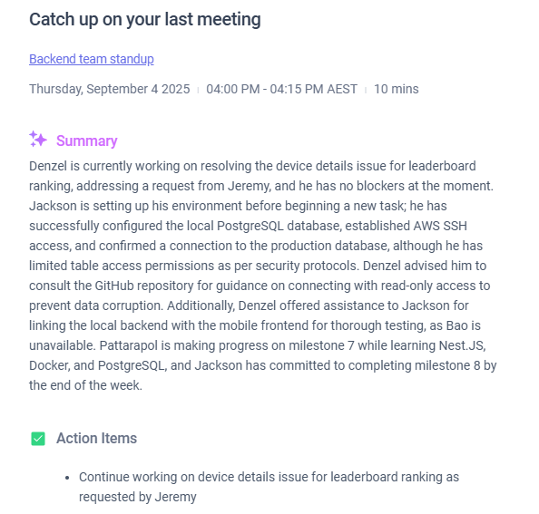

# Agile Ceremonies & Team Collaboration

## How do Agile ceremonies help with communication and alignment?

From attending several Scrum meetings, I've seen how ceremonies keep everyone on the same page. Daily stand-ups help us quickly share what we're working on and identify blockers before they become bigger problems. Sprint planning ensures we all understand what features we're building and why they matter. Retrospectives let us discuss what's working well and what we can improve, so we get better as a team over time. These regular check-ins prevent people from working in isolation and catch issues early.

## Which ceremony do you think is most important for your role, and why?

As a backend developer, I think **daily stand-ups** are most important for my role. They help me coordinate with frontend developers when we're working on the same features, let me know if QA found issues that need quick fixes, and allow me to communicate when I'm blocked waiting for requirements or external dependencies. Since backend work often affects multiple people, the daily sync helps everyone plan their day around what I'm delivering.

## Stand-up meeting observations

In the stand-ups I attended, team members shared what they completed yesterday, what they're working on today, and any blockers they have. Backend developers would mention which APIs they finished or if they were waiting for database schema approvals. Frontend developers would update on UI progress and mention if they needed API changes. The Scrum Master helped resolve blockers by connecting people who could help each other.

## Retrospective experience

The retrospectives I participated in used a "Start, Stop, Continue" format. We discussed what we should start doing (like better API documentation), what we should stop doing (like leaving code reviews pending too long), and what we should continue doing (like pair programming on complex features). Everyone contributed ideas and we picked specific action items to improve our next sprint.

## One change to improve team collaboration

I can improve collaboration by being more proactive in daily stand-ups about potential blockers. Instead of waiting until I'm stuck, I should mention upcoming dependencies early - like if I'll need database changes or external API access in a few days. This gives the team time to help me prepare rather than scrambling when I hit the blocker.

