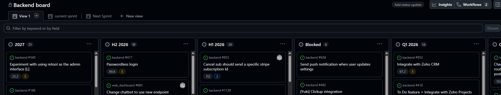
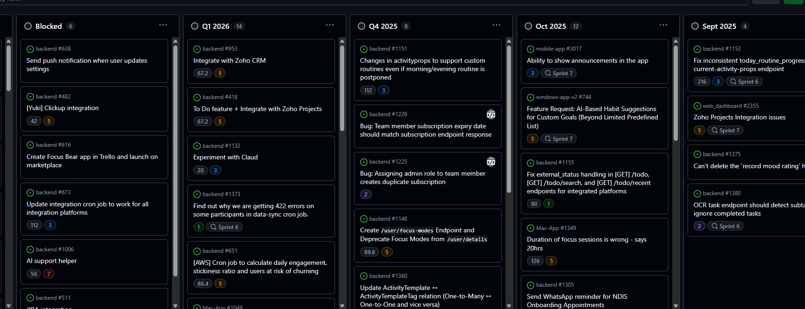
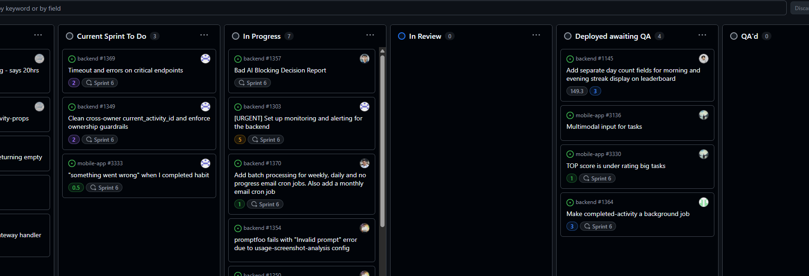

# Agile Workflows & Kanban

## How does Kanban help manage priorities and avoid overload?

Kanban helps me see all my work at once on a visual board, so I can easily spot when I have too many tasks in progress. The WIP (work in progress) limits force me to finish current tasks before starting new ones, which prevents me from getting overwhelmed. I can also see which tasks are blocked or taking too long, so I can ask for help or reprioritize. This keeps me focused on completing things instead of starting everything at once.

## How can you improve your workflow using Kanban principles?

As a backend developer, I can improve my workflow by:
- Setting a WIP limit of 2-3 tasks so I focus on finishing APIs before starting new ones
- Moving tasks to "Blocked" when I'm waiting for requirements or code reviews, so the team knows I need help
- Breaking large features into smaller tasks that move through the board faster
- Using a "Ready for Testing" column so QA knows when features are complete
- Reviewing my board daily to identify bottlenecks in my development process

## Focus Bear's Kanban board structure
Here is the Focus bear's backend kanban board

All tasks have been configured in sprint planning and divided into the following columns on the backend board: 2027, H2 2026, H1 2026, Q1 2026, and Oct 2025. The Blocked column contains all paused tickets that are pending due to external circumstances.

Any issues currently arising in Production that require urgent resolution will be placed in the Drop Dead Urgent column. The project manager will assign tickets to developers, and all active work will appear in the In Progress column. Once developers complete their implementation, tickets are moved to the In Review column. After a senior developer reviews and approves them, they are deployed to production and placed in the Deployed Awaiting QA column.

