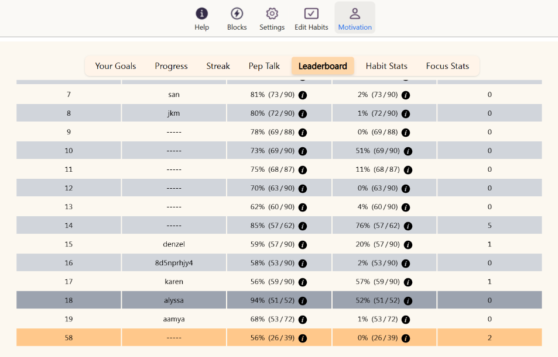

# Occupational Health & Safety (OHS) for Desk-Based Work - Reflection

## What are the risks of using a laptop without an external monitor or keyboard?

Using a laptop without external equipment creates several health problems. The biggest issue is that the screen is too low, which makes me bend my neck down and push my head forward. This puts extra pressure on my neck and can cause pain over time. The keyboard and trackpad are also in the wrong position, making my wrists bend upward while typing, which can lead to wrist pain and repetitive strain injuries. The small screen makes me lean forward and squint to see clearly, which strains my eyes and creates poor posture. My shoulders also end up hunched forward when I try to reach the keyboard comfortably. All of these problems get worse the longer I work, and they can cause long-term pain and injury if I don't fix them.

## What ergonomic equipment can improve posture when working on a laptop?

A laptop stand is the most important piece of equipment because it raises the screen to eye level so I don't have to look down. An external keyboard and mouse are essential too, so I can position my hands properly while keeping the screen at the right height. An adjustable chair with good back support helps me sit upright with my feet flat on the floor. If possible, an external monitor that's bigger than the laptop screen makes it easier to see and reduces eye strain. A document holder can keep papers at eye level so I don't have to look down while typing. Some people also use a footrest if their chair is too high, and wrist rests can help keep wrists in a neutral position while typing.

## What adjustments should be made to monitor height, chair position, and desk setup for a healthier workspace?

The top of my screen should be at or slightly below eye level, so when I look straight ahead, my eyes naturally hit the top third of the screen. My chair should be adjusted so my feet are flat on the floor and my thighs are parallel to the ground. My elbows should hang naturally at my sides and bend at about 90 degrees when I type. The keyboard and mouse should be at the same level as my elbows. I should sit all the way back in my chair so the backrest supports my lower back. The screen should be about arm's length away from me, roughly 20-26 inches. My desk should be at elbow height, and I should make sure there's enough room under the desk for my legs. Good lighting is important too, so I don't have glare on my screen or shadows on my workspace.

## What are some daily habits that reduce the impact of prolonged laptop use?

The most important habit is taking regular breaks using the 20-20-20 rule: every 20 minutes, I look at something 20 feet away for 20 seconds. This helps my eyes relax and refocus. I should also take a longer break every hour to stand up, stretch, and move around. Throughout the day, I need to check my posture and make sure I'm sitting up straight with my shoulders back. Blinking more often helps prevent dry eyes since we blink less when staring at screens. I should also drink plenty of water to stay hydrated and keep my eyes moist. Simple stretches for my neck, shoulders, and wrists can prevent stiffness and pain. Setting reminders on my phone or computer helps me remember to take these breaks and check my posture regularly.

## What equipment changes can you make to improve your workspace setup?

Right now I need to get a laptop stand to raise my screen to eye level, which is the most important change I can make. I also need an external keyboard and mouse so I can position my hands properly while keeping the screen at the right height. My current chair doesn't have good back support, so I need to either get a better chair or add a lumbar support cushion. If possible, I'd like to get an external monitor that's larger than my laptop screen to reduce eye strain and give me more space to work. I should also improve the lighting in my workspace to reduce glare on my screen. These changes will make a huge difference in how comfortable I am while working.

## What behavioural changes can you implement to improve posture and reduce strain?

I will practice sitting up straight with my shoulders back and my feet flat on the floor. I'll make it a habit to check my posture every hour and adjust if I notice I'm slouching or leaning forward. I'll set a timer to remind me to take breaks every 20 minutes for eye rest and every hour for movement. When I'm typing, I'll keep my wrists straight and avoid resting them on the desk. I'll position my screen so I'm looking straight ahead instead of down, and I'll blink more consciously to keep my eyes moist. I'll also make sure to stretch my neck, shoulders, and wrists regularly throughout the day. These small changes will become automatic if I practice them consistently.

## How can you remind yourself to maintain good posture and take breaks throughout the day?

I will use Focus Bear's built-in break reminders to schedule regular movement breaks throughout my workday. Focus Bear is perfect for this because it can remind me to take posture checks and movement breaks at regular intervals. I'll set it up to remind me every 20 minutes to do the 20-20-20 eye exercise and every hour to stand up and stretch. I can also set posture check reminders to make sure I'm sitting correctly. Besides Focus Bear, I'll put a sticky note on my monitor that says "sit up straight" as a visual reminder. I'll also practice the habit of checking my posture every time I finish a task or start something new. Having these multiple reminders will help make good posture and regular breaks become natural habits instead of something I have to remember.

## New OHS Habit for Focus Bear

The new OHS habit I will follow at Focus Bear is the "Posture and Movement Check" routine using Focus Bear's break reminder system. Every 20 minutes, when Focus Bear reminds me to take a break, I'll do three things: First, I'll do the 20-20-20 rule by looking at something far away for 20 seconds. Second, I'll check my posture and adjust my position - shoulders back, feet flat on the floor, screen at eye level. Third, I'll do a quick stretch of my neck and shoulders. Every hour, I'll take a longer break to stand up and walk around for at least 5 minutes. This habit will help prevent the neck pain, eye strain, and back problems that come from sitting at a laptop all day, and it will keep me more focused and comfortable throughout my work at Focus Bear.
Here is my progress:  
