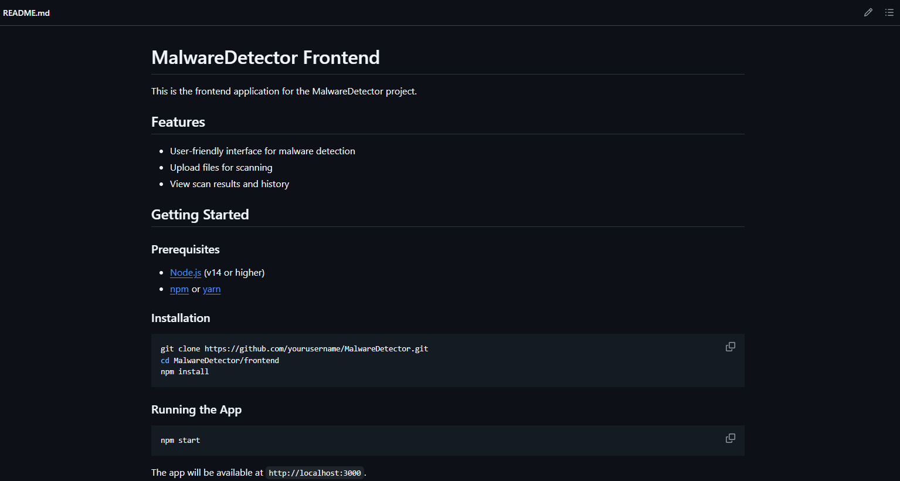

# Use of AI Tools - Reflection

## When should you use AI for assistance, and when should you rely on your own skills?

I use AI for routine tasks like writing boilerplate code, generating test cases, or explaining unfamiliar syntax. It's great for brainstorming solutions or getting unstuck when I hit a wall. However, I rely on my own skills for critical thinking, architectural decisions, and understanding the business logic behind features. When dealing with sensitive code or making important technical decisions, I prefer to work through problems myself first and only use AI as a second opinion.

## How can you avoid over-reliance on AI while still benefiting from it?

I set boundaries for myself - I try to solve problems on my own first for at least 15 minutes before turning to AI. When I do use AI, I make sure I understand the solution it provides rather than just copying and pasting. I regularly practice coding without AI assistance to maintain my problem-solving skills. I also make it a point to research and understand the concepts behind AI suggestions so I can apply similar solutions independently in the future.

## What steps will you take to ensure data privacy when using AI tools?

I'll use generic examples instead of real company data when asking AI for help. Before entering any information, I'll ask myself: "Would I be comfortable if this appeared in a public forum?" If the answer is no, I won't use it. I'll stick to publicly available information and create dummy data for demonstrations. I'll also check with my supervisor before using new AI tools to make sure they're approved for company use.

## Task: Improving Code Documentation with AI

I decided to test using AI to improve my code comments and documentation. I took a function I wrote for handling user input validation and asked ChatGPT to help me write better documentation for it.

The AI generated comprehensive JSDoc comments and explained the function's purpose clearly. However, I noticed it made assumptions about error handling that weren't accurate in my specific implementation. I had to edit the comments to match my actual code behavior and add details about the specific validation rules I was using.

This taught me that while AI is excellent for getting started with documentation structure, I still need to carefully review and customize the output to match my specific implementation.
Here is my project documentation that generated by AI:

## Best Practice for AI Tool Usage at Focus Bear

The best practice I will follow is the "Verify Before Apply" rule. Every time I use AI assistance, I will:

1. Test any code suggestions thoroughly
2. Verify explanations against official documentation
3. Remove any company-specific information before asking for help
4. Understand the reasoning behind AI suggestions rather than just implementing them

This approach lets me benefit from AI's speed and knowledge while maintaining code quality and data security. I'll treat AI as a helpful assistant, not a replacement for critical thinking and proper verification.