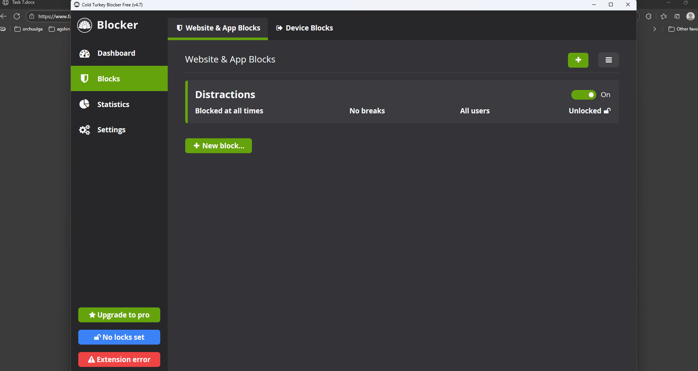
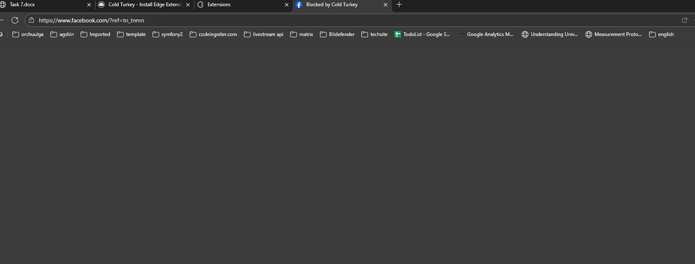
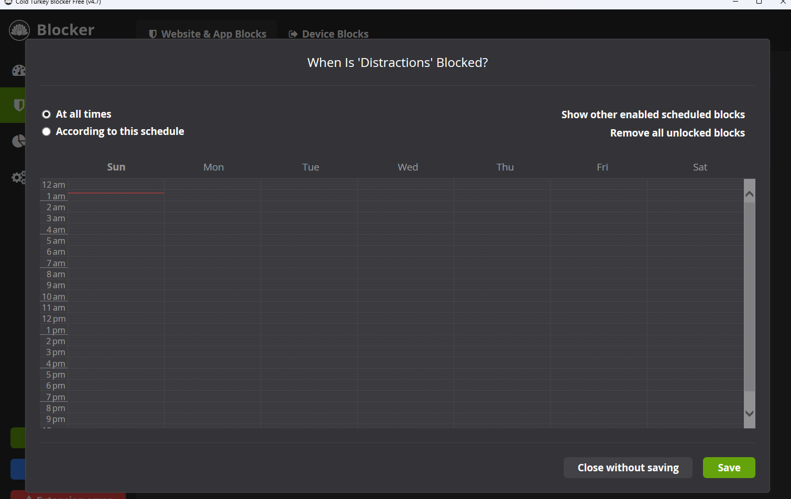

# Competitive Landscape Analysis

## What makes Focus Bear different from these apps?

Focus Bear stands out because it was built specifically by and for people with ADHD and autism, not just adapted for them later. While other apps focus on one area like blocking websites or tracking habits, Focus Bear combines distraction blocking, habit building, smart breaks, and time management into one complete system.

The key difference is Focus Bear's real-time habit guidance - your computer and phone stay locked until you complete your morning routine, actually walking you through each step. Most other apps just remind you to do habits, but Focus Bear does them with you. The "Late No More" feature is also unique because it gives escalating notifications specifically designed for ADHD brains that often miss regular calendar alerts.

Focus Bear also offers two blocking modes - "Cuddly bear" for easy removal and "Grizzly bear" for strict enforcement - giving users control over how strict they want to be with themselves. The smart break system that detects hyper-focus and auto-detects meetings is more sophisticated than simple Pomodoro timers.

## If you were a user, why would you choose Focus Bear over competitors?

I would choose Focus Bear if I had ADHD or struggled with executive function because it's the only app that truly understands neurodivergent challenges. The combination of features works together as a complete productivity ecosystem rather than requiring multiple separate apps.

Specifically, I'd choose Focus Bear for the morning routine enforcement that literally won't let me start my day until I build healthy habits. This is perfect for someone like me who might have good intentions but struggles with follow-through. The smart break detection would prevent me from hyperfocusing for hours and forgetting to eat or rest.

The pricing also seems reasonable compared to subscription models - Focus Bear appears to have straightforward pricing without the complex tiers that Freedom has. The fact that it works across all devices seamlessly means I wouldn't need to manage different apps on different platforms.

## What's one feature that other apps have that Focus Bear doesn't?

**Lifetime pricing option** - Cold Turkey offers a one-time purchase of $39 for lifetime access with free updates forever, while Focus Bear appears to use a subscription model. This is significant because many users prefer paying once rather than ongoing monthly fees.

**Advanced visual planning** - Tiimo has more sophisticated visual scheduling with AI-powered task breakdown that can take a messy list of tasks and automatically organize them into a realistic timeline with time estimates. Focus Bear has scheduling but not the AI-powered planning intelligence that Tiimo offers.

**Frozen mode for complete computer lockdown** - Cold Turkey's "Frozen Turkey" mode completely locks you out of your entire computer, which is more extreme than Focus Bear's blocking. This might be necessary for users with severe digital addiction issues who need maximum enforcement.

## Based on your research, what's one improvement you think Focus Bear could make?

**Add AI-powered task breakdown and realistic time estimation** - This is Tiimo's strongest feature where you can input a complex goal like "prepare for job interview" and the AI breaks it down into specific actionable steps with time estimates. Focus Bear could integrate this into their habit and routine system.

For example, when setting up a morning routine, instead of users having to manually figure out each step and timing, Focus Bear could ask "What do you want to accomplish this morning?" and automatically suggest a realistic routine with proper time allocation. This would be especially helpful for ADHD users who struggle with time estimation and task breakdown.

This improvement would make Focus Bear even more accessible to people who know they need structure but don't know how to create it themselves. It would combine Focus Bear's existing strength in enforcement with Tiimo's strength in intelligent planning, creating the most comprehensive ADHD-friendly productivity solution available.

The AI could also learn from your actual completion times and adjust suggestions over time, making routines more realistic and achievable rather than overly ambitious.

## Direct Experience with Competitor Apps

### Hands-on Testing with Cold Turkey Blocker

I downloaded and tested Cold Turkey Blocker's free version to compare its blocking capabilities with Focus Bear. After installing the desktop app, I set up a basic website blocker to restrict access to social media sites during work hours (9 AM - 5 PM).

**What I tested:**
- Created a "Work Focus" block list including Facebook, Twitter, Instagram, and YouTube
- Configured the timer for a 2-hour session
- Attempted to bypass the blocks using different browsers
- Tested the "Frozen Turkey" complete computer lockdown mode for 15 minutes

**Key observation:** Cold Turkey's blocking was extremely rigid - once activated, there was no "emergency bypass" option even with the free version. When I tried to access a blocked site, I got a stark white page with just text saying "This site is blocked by Cold Turkey." The interface felt very clinical and somewhat intimidating.

**Personal experience:** The "Frozen Turkey" mode completely locked my computer screen with just a timer counting down - I couldn't access anything at all, including work files I might have needed. While effective for extreme cases, this felt too harsh for daily productivity use.

### Personal Routine Integration Example

After testing Cold Turkey's rigid blocking, I realized how much I would value Focus Bear's "Cuddly bear" vs "Grizzly bear" flexibility in my actual daily routine. Here's specifically how this would work for me:

**My morning coding routine scenario:**
- 6:30 AM: Wake up, want to quickly check news (bad habit)
- 6:45 AM: Should do morning stretches and drink water
- 7:00 AM: Review today's development tasks
- 7:30 AM: Start focused coding session

With Cold Turkey, I would have to predict exactly when I'd want strict blocking versus flexibility, and set rigid timers in advance. But my schedule varies - some mornings I get urgent work messages that I legitimately need to respond to.

Focus Bear's approach would let me choose "Cuddly bear" mode during my morning routine (so I can handle genuine emergencies) but switch to "Grizzly bear" mode during deep coding work when I know I shouldn't be interrupted at all. This flexibility matches how my brain actually works - I need different levels of restriction at different times, not just an all-or-nothing approach.

The morning routine enforcement feature specifically appeals to me because I often skip stretches when I'm excited about a coding project, then end up with neck pain later. Having the computer literally walk me through each step would force me to take care of my physical health before diving into work.