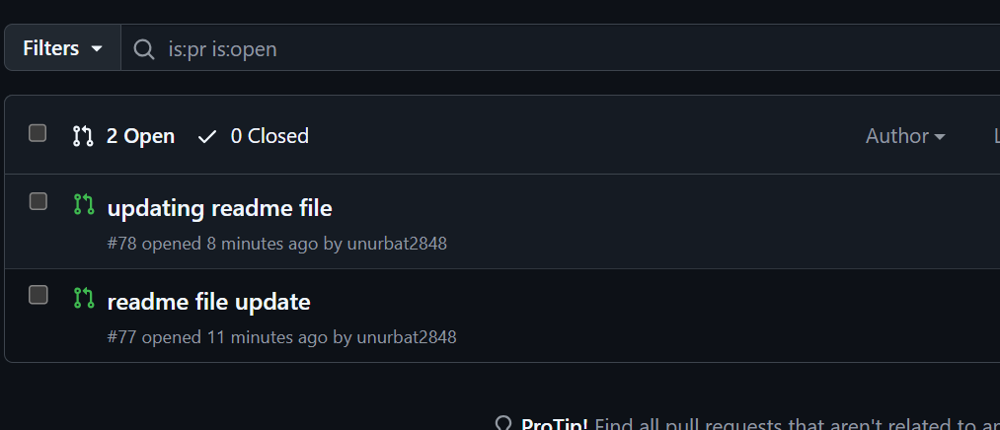
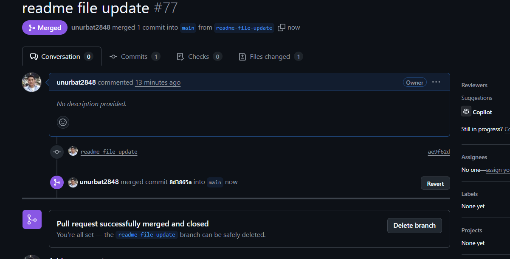
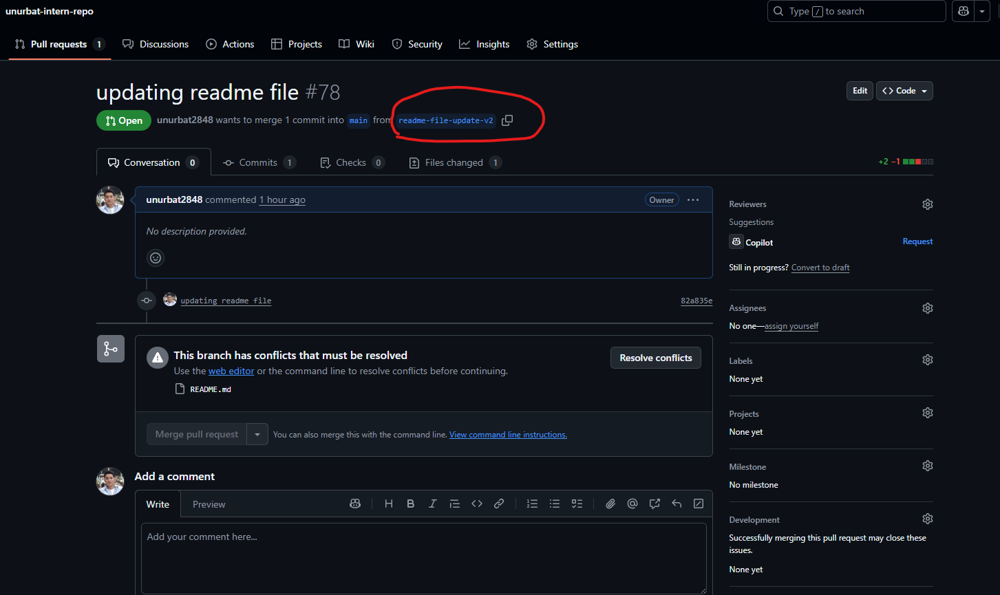
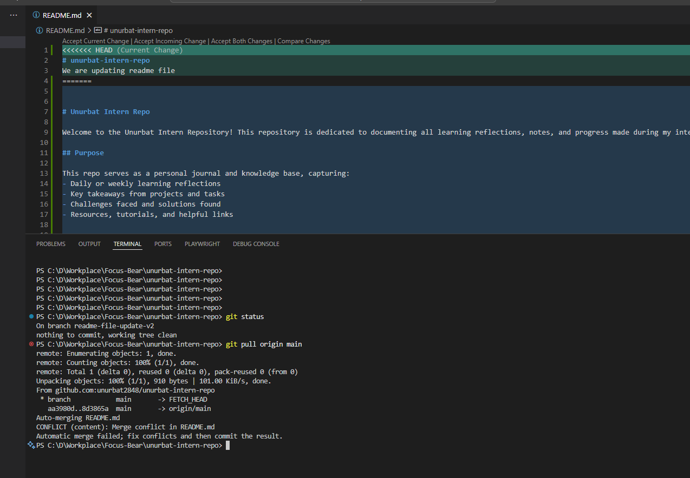
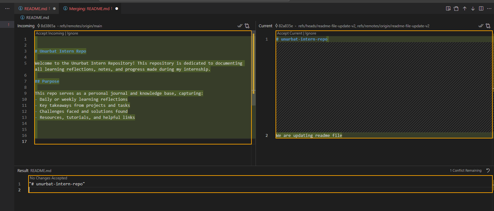
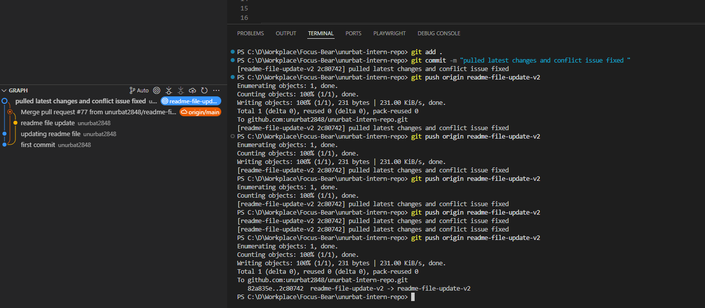

## Merge Conflicts & Conflict Resolution
# What causes conflicts?
Conflicts usually occur when multiple people are working on the same file. For example, let's assume Person 1 creates a new branch and starts working on updating the README file.

Before Person 1 merges their changes into the main branch, another team member, Person 2, also creates a new branch to update the README file.

If Person 1 finishes their update and merges it into the main branch, and then Person 2 tries to push their changes, they will encounter a conflict.

# How do you resolve it?
First, Person 2 needs to pull the latest changes from the main branch.

Then, Person 2 must resolve the conflicts manually. Code editors can help identify and visualize conflicts, making it easier to merge safely. For example, the screenshot below shows how to resolve a conflict using Visual Studio Code.

There are several options to resolve the conflict:
- **Accept all incoming changes** – This will remove your current changes and keep only the incoming changes.
- **Accept all current changes** – This will ignore the incoming changes and keep only your changes.
- **Accept both changes** – This will keep both changes in the file, and you will need to manually edit and decide which changes to keep.
In our case we accepted all changes from main branch and added our changes then pushed to the branch. It will keep latest changes and added most resent changes aswell. 

# What did you learn?
Conflicts often happen as the development team grows, which can lead to miscommunication and more frequent conflicts.

To prevent these issues, teams should be divided into smaller groups, and each group's tasks should be independent from one another. Task management tools can also help organize and assign tasks to developers, reducing the likelihood of conflicts. However, when working on large projects, conflicts are inevitable. The key is to communicate frequently with team members and to learn how to resolve conflicts safely and efficiently.