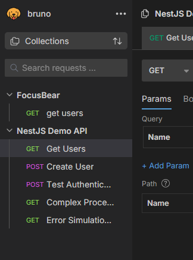
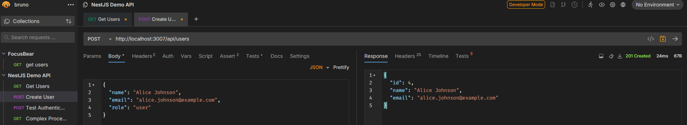
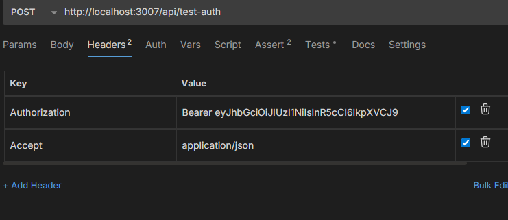
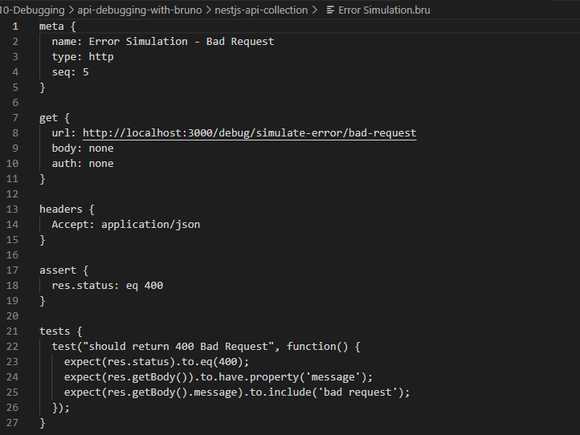
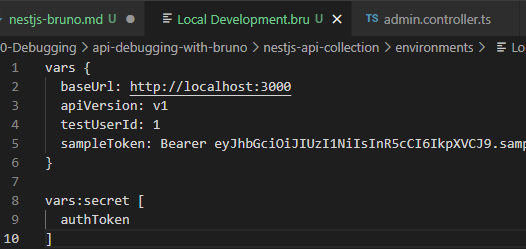
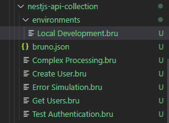
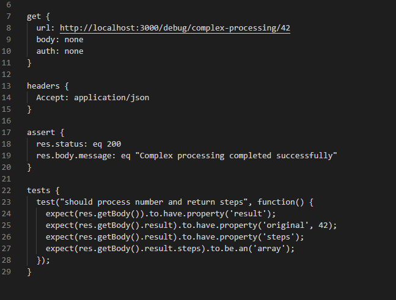

# API Debugging with Bruno

## How does Bruno help with API testing compared to Postman or cURL?

Bruno is like having a lightweight sports car instead of a big truck - it does exactly what you need without all the extra weight. Unlike Postman which stores everything in the cloud and charges for team features, Bruno saves all your API requests as simple text files right in your project folder. This means I can version control them with Git just like my code, and my whole team can share API tests without paying subscription fees. Compared to cURL commands that are hard to remember and organize, Bruno gives me a nice visual interface but keeps everything stored locally as plain files. In my demo collection, I created requests for testing user creation, authentication, and complex processing that the whole team can use and modify.

Here is my Bruno collection structure:

Here is a Bruno request for testing user creation:

## How do you send an authenticated request in Bruno?

Sending authenticated requests in Bruno is like having a special VIP pass - you just add it to the headers section and Bruno remembers it for you. In my demo, I created a "Test Authentication" request that includes a Bearer token in the Authorization header. Bruno makes this super easy because you can either type the token directly in the headers section, or save it as an environment variable if you want to reuse it across multiple requests. The best part is that since Bruno saves everything as text files, sensitive tokens can be stored in environment variables and kept out of version control, so they don't accidentally get committed to Git.

Here is setting up authentication headers in Bruno:

## What are the advantages of organizing API requests in collections?

Organizing API requests in collections is like having a well-organized toolbox where every tool has its place. Instead of scattered individual requests, I can group related endpoints together, share common settings like base URLs and headers, and run entire test suites with one click. In my NestJS demo collection, I organized requests into logical groups: user management (create, read, update, delete), authentication testing, error handling, and complex processing. Each request can have its own assertions and tests, so I can quickly verify that all endpoints work correctly. Collections also make it easy for new team members to understand and test the API without having to learn all the endpoints from scratch.

Here is my organized collection with different request types:

Here is the environment variables setup:

## How would you structure a Bruno collection for a NestJS backend project?

I would structure a Bruno collection for NestJS like organizing a restaurant menu - group similar items together and make it easy to find what you need. For my demo project, I created a structure with the main collection folder containing individual .bru files for each endpoint, plus an environments folder for different settings (local, staging, production). I organized requests by feature area: user management, authentication, debugging endpoints, and error simulation. Each request file includes proper assertions to verify responses, and I use environment variables for things like base URLs and authentication tokens. This way, developers can easily switch between environments and run comprehensive API tests to make sure everything works before deploying.

Here is my complete collection file structure:

Here is running a request with assertions and tests:
