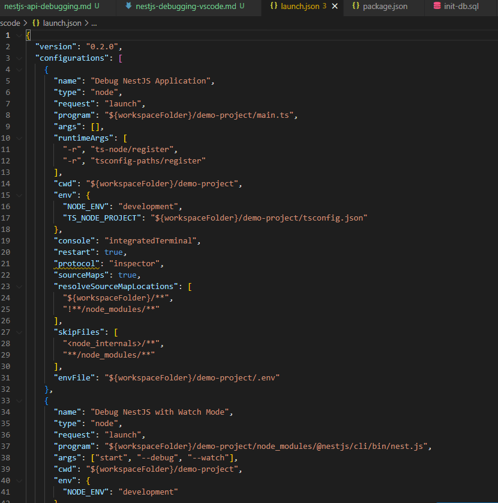
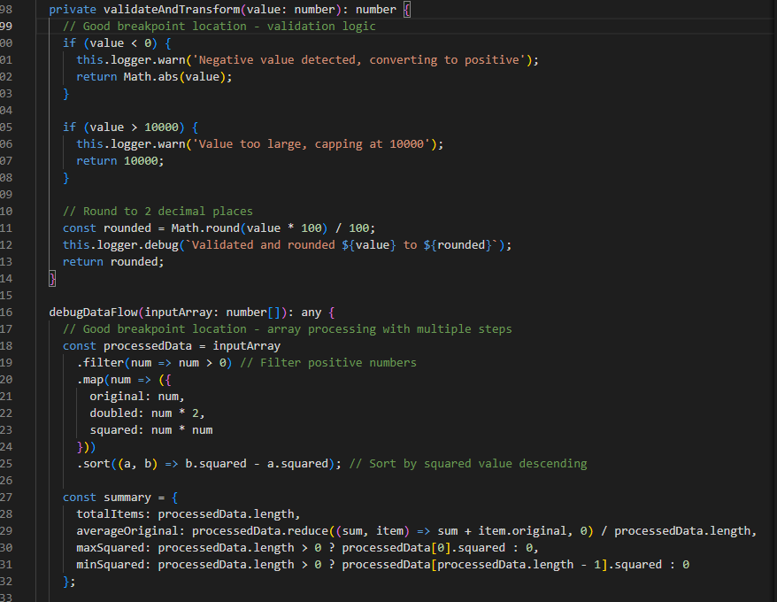
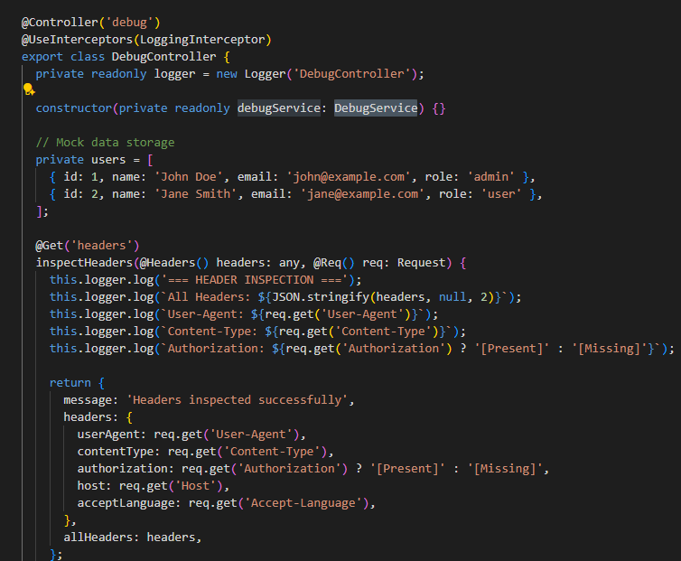
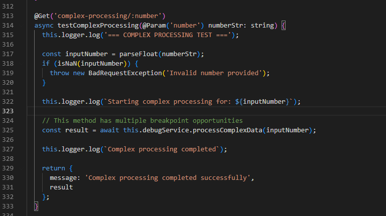
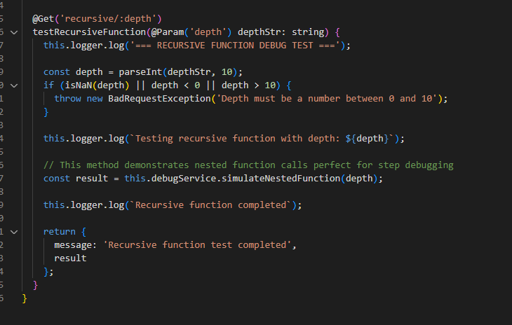

# Debugging with VS Code & Breakpoints

## How do breakpoints help in debugging compared to console logs?

Breakpoints are like pressing pause on a movie to examine each frame closely, while console logs are like having someone shout random facts during the movie. With breakpoints, I can stop my code exactly where something interesting happens and inspect every variable, see the call stack, and step through line by line. Console logs only show me what I thought to log ahead of time, but breakpoints let me explore everything that's available at that moment. In my demo project, I created a DebugService with complex data processing where I can set breakpoints and watch how data transforms through each step, instead of cluttering my code with temporary console.log statements that I'd have to remove later.

Here is my VS Code launch.json configuration:

Here is my DebugService with strategic breakpoint locations:

## What is the purpose of `launch.json`, and how does it configure debugging?

The `launch.json` file is like a recipe that tells VS Code exactly how to cook your debugging session. It's the configuration file that sets up how to start your application with debugging superpowers turned on. In my setup, I created three different debugging recipes: one for direct debugging with ts-node, another for watch mode that restarts when files change, and a third for attaching to an already running process. It configures things like which file to run (main.ts), what runtime arguments to use (ts-node for TypeScript), which folder to run from, and what environment variables to set. Think of it like the difference between just running `npm start` versus running it with a debugger attached that can pause, inspect, and step through your code.

Here is VS Code showing the debug configuration dropdown:

## How can you inspect request parameters and responses while debugging?

Inspecting request data while debugging is like being able to freeze time during a conversation to examine exactly what someone said and how you're responding. When I set breakpoints in my controller methods, I can see all the incoming data: URL parameters from `@Param()`, request body from `@Body()`, query strings from `@Query()`, and headers from `@Headers()`. I can step through the processing logic and watch how that input data gets transformed into a response. In my demo, I created endpoints like `/debug/complex-processing/50` where I can set breakpoints and see how the parameter "50" flows through validation, gets processed by the service, and becomes the final response data.

Here is stepping through the debugging controls:

## How can you debug background jobs that don't run in a typical request-response cycle?

Debugging background jobs is like trying to catch a bus that runs on its own schedule - you need different strategies than debugging regular web requests. Background jobs don't have the typical HTTP request flow, so I use approaches like testing the core business logic separately from the job framework, setting breakpoints and manually triggering jobs during development, or creating test endpoints that simulate the job processing. In my demo, I built a recursive function that mimics complex background processing where I can set breakpoints at each level of recursion and watch the call stack build up and data accumulate. The key is isolating the actual work from the scheduling mechanism so you can debug the logic directly.

