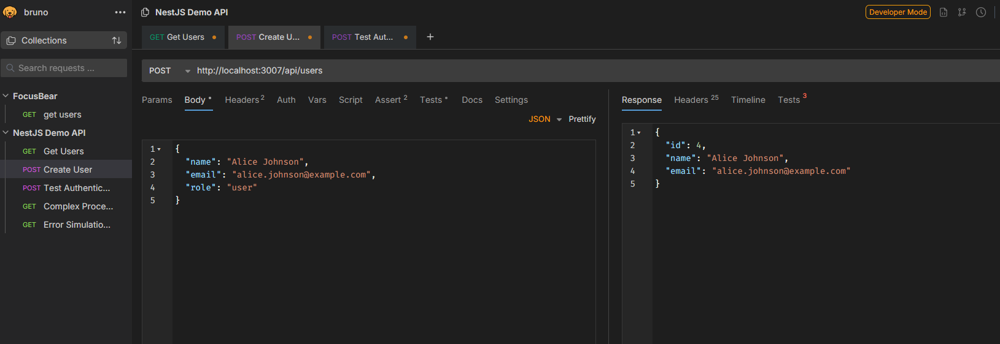

# Inspecting API Requests & Responses

## How can logging request payloads help with debugging?

Logging request payloads is like having a security camera for your API - you can see exactly what data is coming in and when things go wrong. In my demo project, I created a LoggingInterceptor that captures all incoming request details including headers, body, query parameters, and path parameters. This helps me debug issues like missing required fields, incorrect data types, or malformed JSON. For example, when a user creation fails, I can check the logs to see if the required 'name' and 'email' fields were actually sent in the request body, saving hours of guessing what went wrong.

Here is my LoggingInterceptor implementation:

Here is my DebugController with detailed request logging:

## What tools can you use to inspect API requests and responses?

The main tools for API inspection are like different types of magnifying glasses - each one shows you different details. **Postman** is great for manual testing with a user-friendly interface where you can easily set headers, body data, and see formatted responses. **Bruno** is a newer lightweight alternative that's privacy-focused and stores requests as files. **curl** is perfect for command-line testing and automation scripts. In my demo, I also used **NestJS interceptors** which act like built-in API watchers that automatically log every request and response. For browser testing, **Chrome DevTools Network tab** shows all HTTP requests with detailed timing and headers.

Here is a Bruno request example:

Here is the NestJS server logs showing intercepted requests:

## How would you debug an issue where an API returns the wrong status code?

Debugging wrong status codes is like being a detective - you need to trace the path from request to response. First, I check the controller method to see what status code it's supposed to return, then look at the interceptor logs to see what actually happened. In my DebugController, I created a custom response endpoint that lets me test different status codes. I also added error simulation endpoints that throw different types of exceptions to see how NestJS converts them to HTTP status codes. The key is logging both the intended response and any exceptions that might change the status code, like validation errors turning a 200 into a 400.

Here is my custom response endpoint:

Here is error simulation showing different status codes:

## What are some security concerns when logging request data?

Logging request data is like keeping a diary - you want to remember important things but not expose secrets. The biggest concerns are accidentally logging sensitive information like passwords, API keys, credit card numbers, or personal data. In my LoggingInterceptor, I created filtering functions that automatically redact sensitive fields before logging. I filter out authorization headers, passwords, and other sensitive fields by replacing them with '[REDACTED]'. I also truncate very large responses to prevent log files from growing too big. Another concern is log storage security - these logs should be encrypted, have limited access, and be automatically deleted after a retention period.

Here is my security filtering implementation:

Here is an example of filtered log output:
