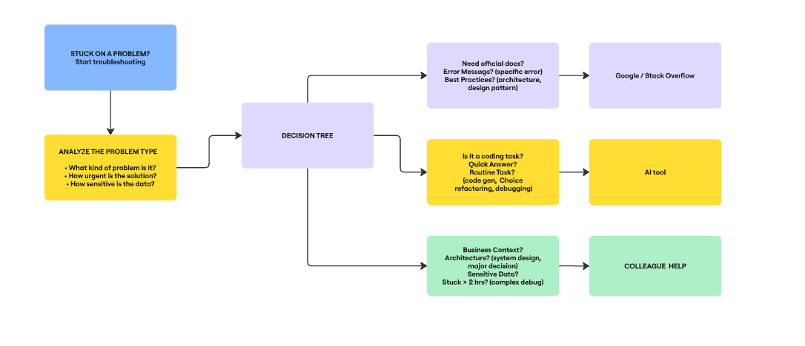

# When You Get Stuck - What Next?

## When do you prefer using AI vs. searching Google?

I prefer using AI when I need quick explanations or want to understand code that looks confusing - it's like having a patient tutor who can break things down in simple terms. AI is amazing for generating code examples, explaining error messages, and helping me refactor messy code. I use it when I want to learn something new because I can ask follow-up questions and get instant answers. But I switch to Google when I need the "official truth" about how something works, especially for documentation, specific error messages, or when I want to see multiple different approaches to the same problem. Google is better when I know exactly what I'm looking for but need to find the authoritative source or compare different solutions.

Here is my decision flowchart for choosing help resources:

## How do you decide when to ask a colleague instead?

I ask a colleague when the problem involves our company's specific way of doing things, like business rules or internal systems that only we know about. It's like the difference between asking a general cooking question versus asking about your family's secret recipe - some knowledge only exists within your team. I also ask colleagues when I've been stuck for more than 2 hours because fresh eyes often spot things I missed. Security issues are always a colleague conversation because I don't want to accidentally share sensitive information with external AI tools. And when I need to make big architectural decisions, I want human judgment and experience, not just technical answers - colleagues help me think through the trade-offs and long-term consequences.

Here is my escalation strategy when I get stuck:

## What challenges do developers face when troubleshooting alone?

The biggest challenge is getting tunnel vision - when you're staring at the same code for hours, your brain stops seeing obvious mistakes. It's like trying to proofread your own writing; you read what you think you wrote instead of what's actually there. Another problem is not knowing when to stop and ask for help - I've wasted entire days on problems that a colleague could have solved in 5 minutes. There's also the challenge of incomplete context; sometimes the real problem isn't in the code you're looking at but in some other part of the system that you don't know about. And finally, there's the emotional aspect - frustration and stress make it harder to think clearly, and working alone means there's no one to help you step back and approach the problem differently.
