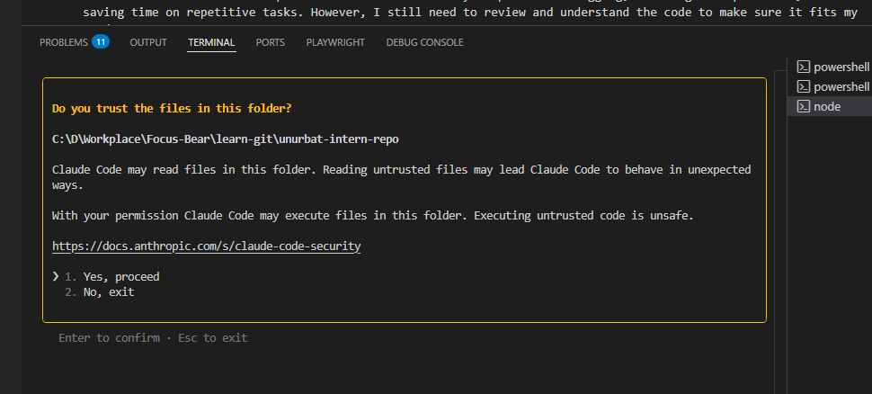
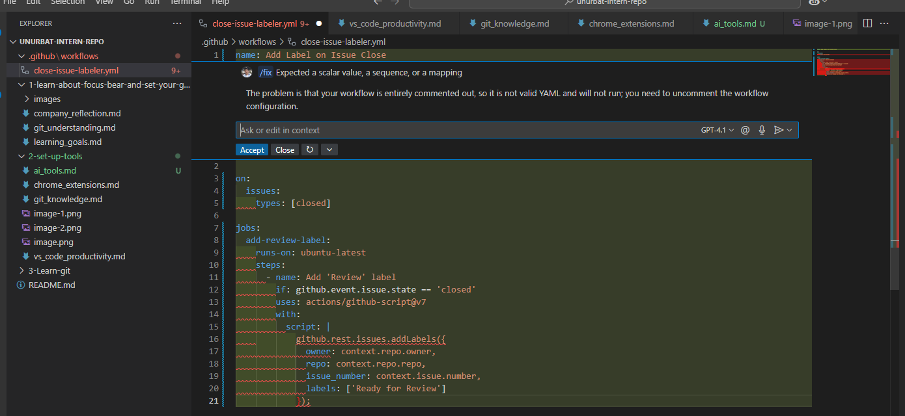

# Set Up AI Tools for Development

## Which AI tools did you try?
I tried using ChatGPT, Claude, GitHub Copilot, and Cursor AI.
## What worked well? What didn’t?
ChatGPT and Claude were great for answering questions, explaining concepts, and helping me brainstorm ideas. 

Copilot was especially helpful for suggesting code snippets and speeding up repetitive coding tasks. 

I also tried Cursor AI, but sometimes it struggled with code that has long rows and didn’t work as well in those cases. On the other hand, Claude worked really well and handled my code more reliably. Sometimes, the AI suggestions weren’t exactly what I needed, so I had to double-check and tweak the code myself. Also, Copilot occasionally made suggestions that didn’t fit my project’s context.
## When do you think AI is most useful for coding?
I think AI is most useful for coding when I’m stuck on a problem, need to quickly generate boilerplate code, or want to understand new concepts faster. It’s also really helpful for debugging, learning best practices, and saving time on repetitive tasks. However, I still need to review and understand the code to make sure it fits my needs.

