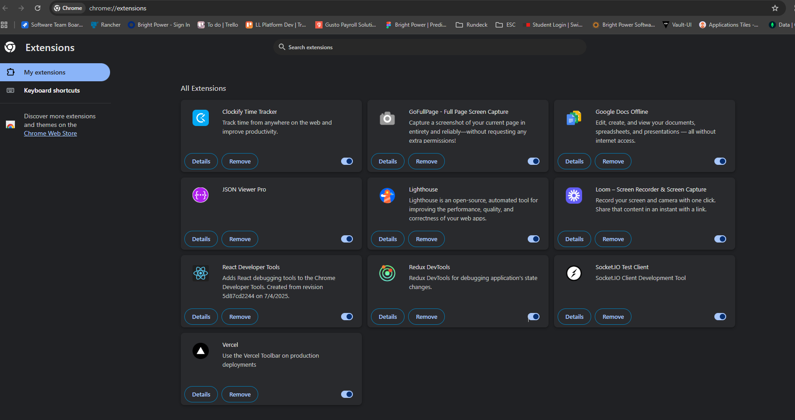

#  Set Up Dev Productivity Chrome Extensions

## Which extensions did you install? Why?
I installed the following Chrome extensions to boost my productivity as a developer:

- **React Developer Tools**: To inspect and debug React components directly in the browser.
- **Socket.IO Test Client**: For testing and debugging real-time Socket.IO connections.
- **Redux DevTools**: To easily track and debug Redux state changes in my React apps.
- **Loom – Screen Recorder & Screen Capture**: For quickly recording and sharing my screen, which is super helpful for demos and bug reports.
- **A JSON Viewer**: To pretty-print and explore JSON data, making API responses much easier to read.
- **Lighthouse**: For running performance audits and getting suggestions to improve my web apps.

## What was the most useful thing you learned?
The most useful thing I learned was how much time and effort these extensions can save. For example, React Developer Tools and Redux DevTools make it so much easier to debug complex state and component issues. Lighthouse also gave me actionable feedback to improve my app’s performance. Overall, using the right extensions really streamlines my workflow and helps me catch issues faster.