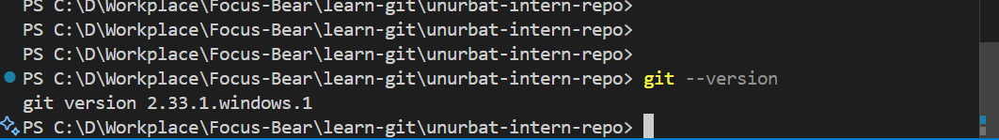

# Git Basics Reflection

**Have you used Git before? If so, in what context?**
Yes, I have used Git before, mainly for managing code versions in software development projects. I’ve used it to track changes, collaborate with teammates, and keep a history of my work.

**Which Git client (if any) did you choose? Why?**
I usually use the command line interface (CLI) for Git because it gives me full control and helps me understand what’s happening behind the scenes. Sometimes, I also use graphical clients like GitHub Desktop or the built-in Git tools in VS Code for convenience, especially when visualizing branches and commits.

**What was the most interesting thing you learned about Git today?**
I learned about the `git cherry-pick` command today, which was new to me. It allows you to apply a specific commit from one branch onto another branch without merging the entire branch. This seems really useful when working with multiple branches in a project, especially if you want to bring a self-contained feature or bug fix from one branch into another without including all the other changes from the source branch. I haven’t tried it yet, but I can see how it could help keep branches clean and focused.
