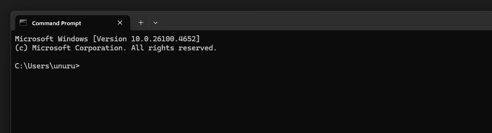

# Set up a terminal client

## Which terminal client did you choose? Why?

I chose the Windows default terminal (Windows Terminal) because Windows 11 now supports Linux commands, making it versatile and convenient for both Windows and Linux workflows.

## What customizations (if any) did you make?

I haven't used any customizations yet; the default setup meets my current needs.

## What was the most useful command you learned today?

The most useful command I learned today was using Linux commands like `ls` and `pwd` directly in the Windows terminal, which helps with navigation and file management.
