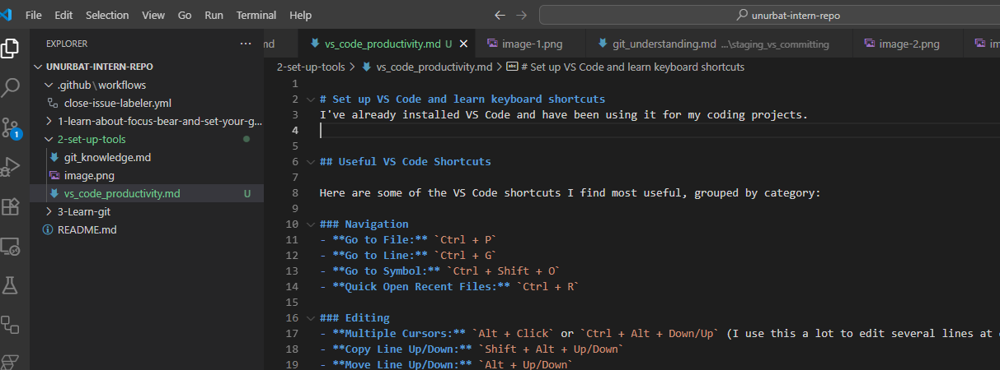

# Set up VS Code and learn keyboard shortcuts
I've already installed VS Code and have been using it for my coding projects. 

## Useful VS Code Shortcuts

Here are some of the VS Code shortcuts I find most useful, grouped by category:

### Navigation
- **Go to File:** `Ctrl + P`
- **Go to Line:** `Ctrl + G`
- **Go to Symbol:** `Ctrl + Shift + O`
- **Quick Open Recent Files:** `Ctrl + R`

### Editing
- **Multiple Cursors:** `Alt + Click` or `Ctrl + Alt + Down/Up` (I use this a lot to edit several lines at once)
- **Copy Line Up/Down:** `Shift + Alt + Up/Down`
- **Move Line Up/Down:** `Alt + Up/Down`
- **Format Document:** `Shift + Alt + F`
- **Comment/Uncomment Line:** `Ctrl + /`

### Debugging
- **Start/Continue Debugging:** `F5`
- **Step Over:** `F10`
- **Step Into:** `F11`
- **Toggle Breakpoint:** `F9`

### Terminal Commands
- **Show Integrated Terminal:** `Ctrl + ` (backtick)
- **Create New Terminal:** `Ctrl + Shift + ` (backtick)

---

#### Shortcuts I Use Most
- **Multiple Cursors**: This is a must-have for me when I need to make the same change in multiple places.
- **Go to File/Symbol**: Super helpful for quickly jumping around my project.
- **Comment/Uncomment**: I use this all the time when testing or reviewing code.
- **Show Terminal**: I like being able to open the terminal quickly without leaving the editor.

#### How Keyboard Shortcuts Help Me
Using keyboard shortcuts really speeds up my workflow. I don’t have to keep reaching for the mouse, so I can stay focused and get things done faster. They make it easier to navigate, edit, and debug my code, and help me avoid repetitive tasks. The more shortcuts I learn, the more productive I feel when coding.