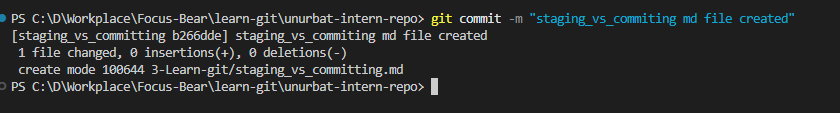
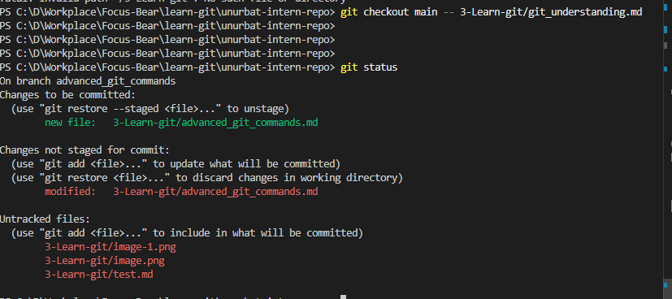

# Advanced Git Commands & When to Use Them
 I think "git checkout main --<file>" command is really useful some cases. For example if I work on the task and updated many files but while developing new feature I messed up configuration file and want to restore it from main branch. In that case if that command will really resolve that issue and retore only that file. 
I created new branch for advanced_git_commands and create new test.md file for experiment. 

Then I made changes several files and want to restore git_understanding.md file without affecting other my changes. 

That command really works well and it restored git_understanding.md file and didn't affected with other file.

## What does each command do?
git checkout main -- <file> 
git cherry-pick <commit>
git log 
git blame <file> 
### What does each command do?

**git checkout main -- <file>**
This command lets you restore a specific file from the main branch, without touching your other changes. It's really helpful if you mess up a file and just want to get it back to how it is on main, while keeping your work on other files.

**git cherry-pick <commit>**
This command takes a single commit from another branch and applies it to your current branch. It's useful if you want to bring over just one specific change, instead of merging everything from another branch.

**git log**
This shows you the history of commits in your repository. You can see who made each change, when, and what the commit message was. It's great for tracking progress and understanding what happened over time.

**git blame <file>**
This command shows you who last changed each line in a file. It's super useful if you want to know who wrote a particular line or when it was changed, especially when debugging or reviewing code.
## When would you use it in a real project (hint: these are all really important in long running projects with multiple developers)?
## What surprised you while testing these commands?