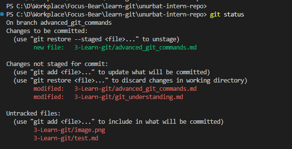
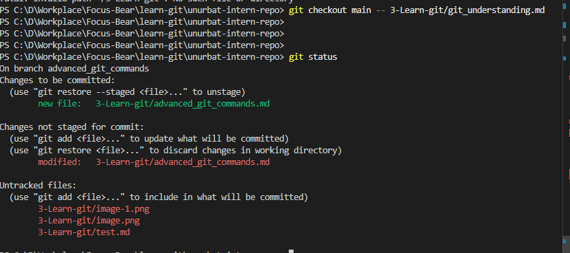
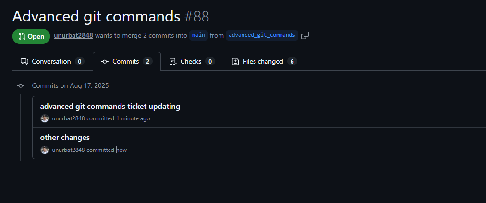
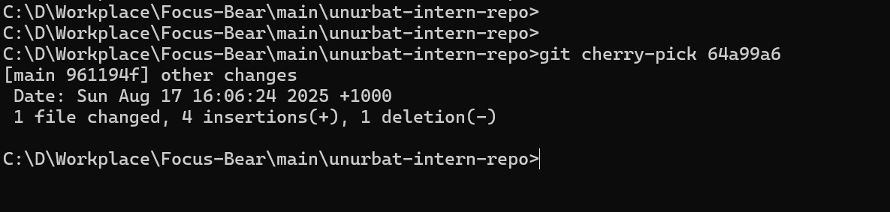
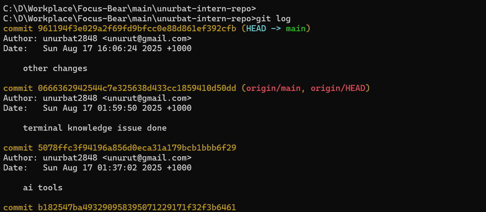
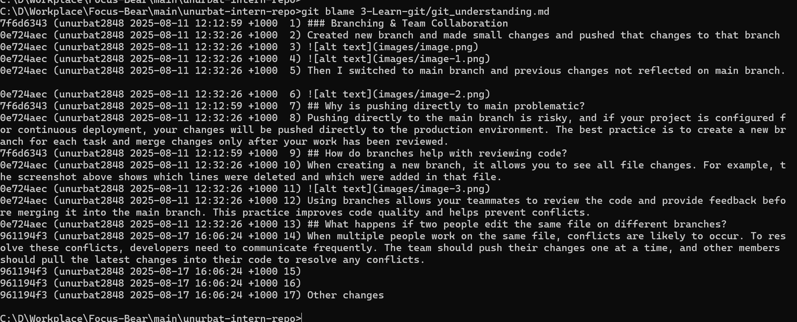

# Advanced Git Commands & When to Use Them

I think "git checkout main --<file>" command is really useful some cases. For example if I work on the task and updated many files but while developing new feature I messed up configuration file and want to restore it from main branch. In that case if that command will really resolve that issue and retore only that file.
I created new branch for advanced_git_commands and create new test.md file for experiment.

Then I made changes several files and want to restore git_understanding.md file without affecting other my changes.

That command really works well and it restored git_understanding.md file and didn't affected with other file.

### What does each command do?

**git checkout main -- <file>**
This command lets you restore a specific file from the main branch, without touching your other changes. It's really helpful if you mess up a file and just want to get it back to how it is on main, while keeping your work on other files.

**git cherry-pick <commit>**
This command takes a single commit from another branch and applies it to your current branch. It's useful if you want to bring over just one specific change, instead of merging everything from another branch.
For example, I made two commits on my branch, but I only want to apply one specific commit to the main branch.

To do this, I switched to the main branch and cherry-picked the specific commit I wanted to add to main.

**git log**
This shows you the history of commits in your repository. You can see who made each change, when, and what the commit message was. It's great for tracking progress and understanding what happened over time.
Here is my main branch git log. We can see that cherry-picked commit exist in main branch.

**git blame <file>**
This command shows you who last changed each line in a file. It's super useful if you want to know who wrote a particular line or when it was changed, especially when debugging or reviewing code.

## When would you use it in a real project (hint: these are all really important in long running projects with multiple developers)?

These commands are especially useful in real projects with multiple developers and long-running branches:

- `git checkout main -- <file>` is great when you want to quickly fix a file you accidentally broke, without losing your other work. It's also helpful if you need to update a config or documentation file to match the main branch, but keep your feature changes.
- `git cherry-pick <commit>` is perfect for bringing a bug fix or important update from one branch to another, without merging all the other changes. This is common when you need to hotfix something on main but still have ongoing work in your feature branch.
- `git log` helps you track the history of changes, see what was done, and by whom. It's essential for code reviews, debugging, and understanding the project's progress.
- `git blame <file>` is very useful when you need to find out who last changed a specific line, especially when tracking down bugs or understanding why a change was made.

## What surprised you while testing these commands?

I was surprised by how powerful and precise these commands are. For example, `git checkout main -- <file>` restored just one file and didn't touch my other changes, which is really convenient. Also, `git cherry-pick` made it easy to move a single commit between branches without any extra work. I didn't expect `git blame` to show so much detail about each line's history, which makes it much easier to understand the codebase. Overall, these commands give you a lot of control over your project history and collaboration.
