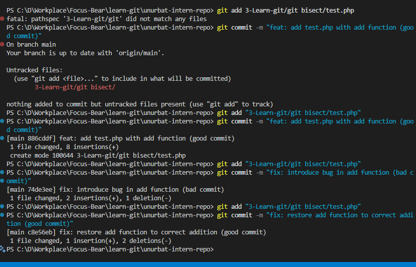
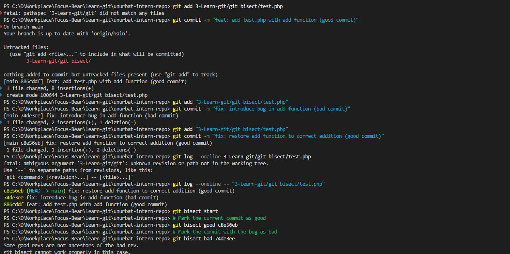

# Understand git bisect

I added test.php file and made severall commits with has good and bad for test bisect command.  

To use git bisect, first I found a commit where my code was working fine (good) and a commit where the bug appeared (bad). I started with `git bisect start`, then used `git bisect good <good-commit-hash>` for the working commit and `git bisect bad <bad-commit-hash>` for the buggy one.
Git checked out a commit in between, and I tested if the bug was there. If it was, I marked it as bad; if not, I marked it as good. Git kept repeating this process, checking out new commits in between, until it found the exact commit that caused the bug. This was much faster and easier than checking every commit one by one.

## What does git bisect do?

`git bisect` is a tool that helps you quickly find the commit that introduced a bug by using a binary search. Instead of checking every commit one by one, it automatically checks out commits halfway in between a known good and bad commit, letting you test and mark each as good or bad until it pinpoints the exact commit where the bug was introduced.

## When would you use it in a real-world debugging situation?

I would use `git bisect` when I know there is a bug in my code, but I don't know which commit caused it. For example, if something was working last week but now it's broken, and there are a lot of commits in between, `git bisect` helps me quickly find the exact commit that introduced the problem. This saves a lot of time compared to checking every commit one by one.

## How does it compare to manually reviewing commits?

Manually reviewing commits can be slow and tedious, especially in large projects with lots of history. `git bisect` automates the process and uses binary search, so it only takes a few steps to find the bad commit, even if there are hundreds of commits. This saves a lot of time and reduces the chance of missing the bug.

## Reflection on the experiment

I created a test file, made several commits, and intentionally introduced a bug in one of them. Using `git bisect`, I was able to quickly identify the exact commit that caused the issue. The process was straightforward: I marked the current commit as bad, an older commit as good, and then followed the prompts to test and mark each suggested commit. Compared to manually checking each commit, `git bisect` was much faster and more efficient. I can see how this would be extremely helpful in real projects, especially when debugging tricky issues that aren't immediately obvious.
