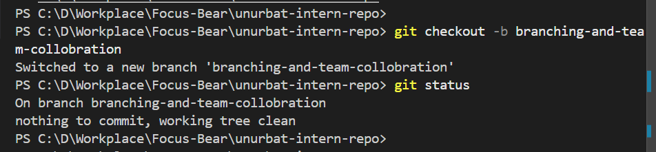
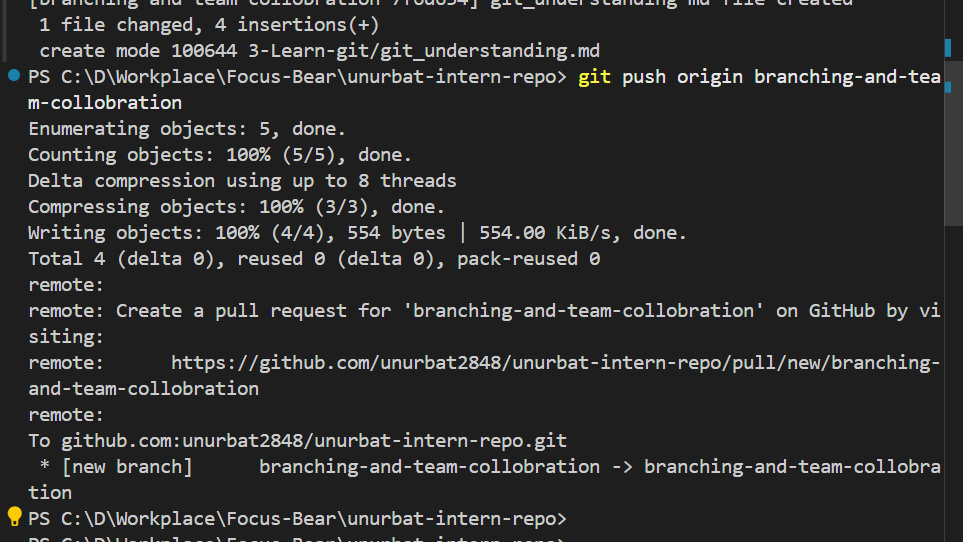
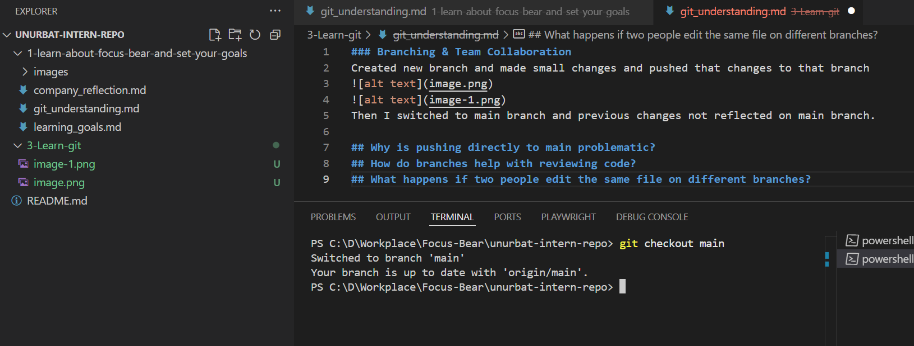
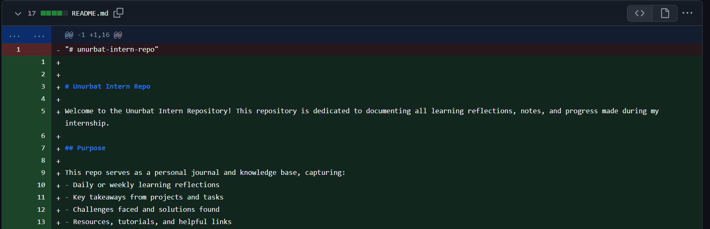

### Branching & Team Collaboration

Created new branch and made small changes and pushed that changes to that branch

Then I switched to main branch and previous changes not reflected on main branch.

## Why is pushing directly to main problematic?

Pushing directly to the main branch is risky, and if your project is configured for continuous deployment, your changes will be pushed directly to the production environment. The best practice is to create a new branch for each task and merge changes only after your work has been reviewed.

## How do branches help with reviewing code?

When creating a new branch, it allows you to see all file changes. For example, the screenshot above shows which lines were deleted and which were added in that file.

Using branches allows your teammates to review the code and provide feedback before merging it into the main branch. This practice improves code quality and helps prevent conflicts.

## What happens if two people edit the same file on different branches?

When multiple people work on the same file, conflicts are likely to occur. To resolve these conflicts, developers need to communicate frequently. The team should push their changes one at a time, and other members should pull the latest changes into their code to resolve any conflicts.

Other changes
