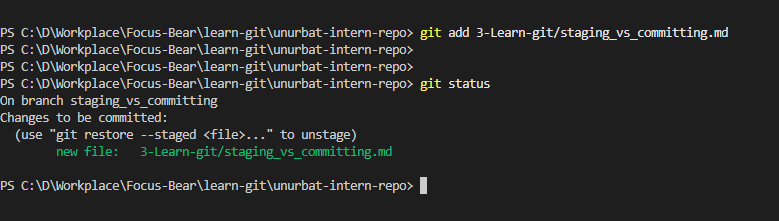
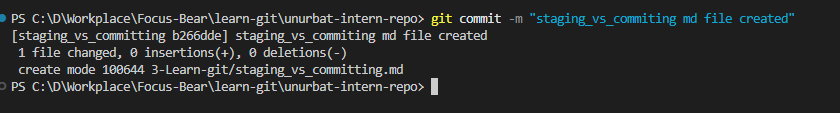
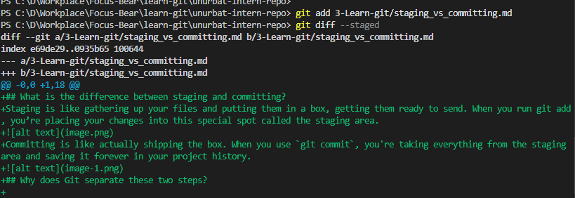
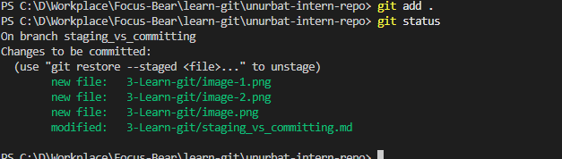

## What is the difference between staging and committing?

Staging is like gathering up your files and putting them in a box, getting them ready to send. When you run git add, you’re placing your changes into this special spot called the staging area.

Committing is like actually shipping the box. When you use `git commit`, you're taking everything from the staging area and saving it forever in your project history.

## Why does Git separate these two steps?

- You get to pick exactly which changes you want to save—maybe you worked on three files, but only want to keep two of them for now.
- You can review your changes before making them permanent, so you know exactly what’s being saved.
- You can organize related updates together, making sure that things that belong in the same commit stay together.
  It’s kind of like having a draft before turning in your final work—you get to look things over and decide what makes the cut.

## When would you want to stage changes without committing?

Sometimes you’ll stage your files but hold off on committing them, like when:

- You’ve finished part of your work and want to save your progress, but you’re not completely done yet.
- You want to take another look at your changes before making them official.
- You spot a small mistake after staging a big update and want to fix it first.
- You need to grab the latest updates from your teammates before you commit your own work.
  

## What I learned

The staging area is like a safe place to keep your work before you make it permanent. It gives you control over exactly what gets saved and when. This is really helpful when you're working on big projects or with other people.
