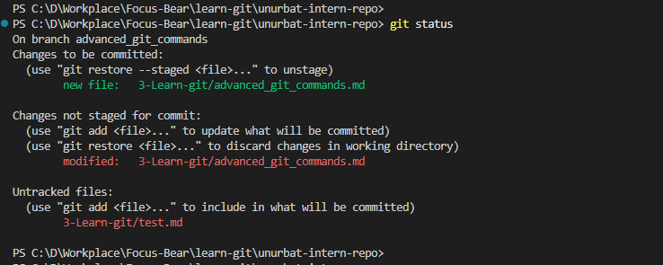

# Advanced Git Commands & When to Use Them
 I think "git checkout main --<file>" command is really useful some cases. For example if I work on the task and updated many files but while developing new feature I messed up configuration file and want to restore it from main branch. In that case if that command will really resolve that issue and retore only that file. 
I created new branch for advanced_git_commands and create new test.md file for experiment. 

Then I made changes several files and want to restore advanced_git_commands.md file without affecting other my changes. 
## What does each command do?
git checkout main -- <file> 
git cherry-pick <commit>
git log 
git blame <file> 
## When would you use it in a real project (hint: these are all really important in long running projects with multiple developers)?
## What surprised you while testing these commands?