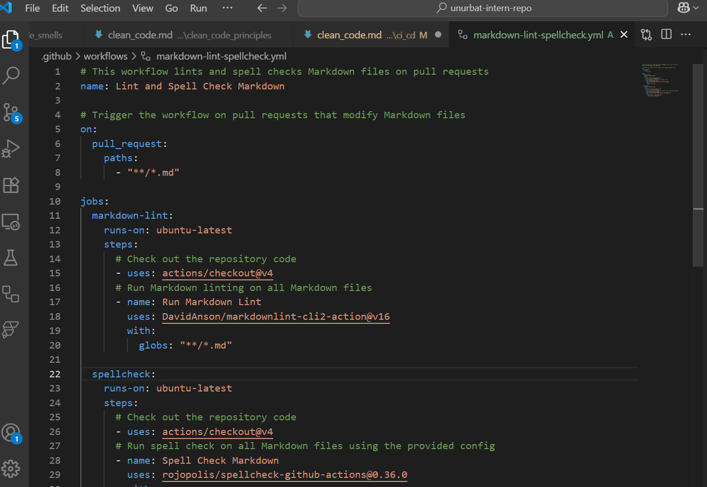
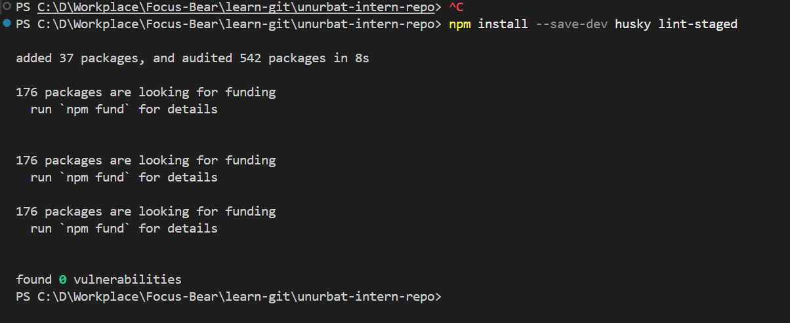
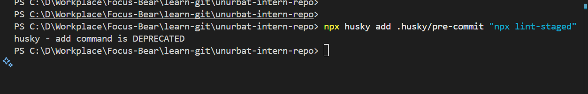
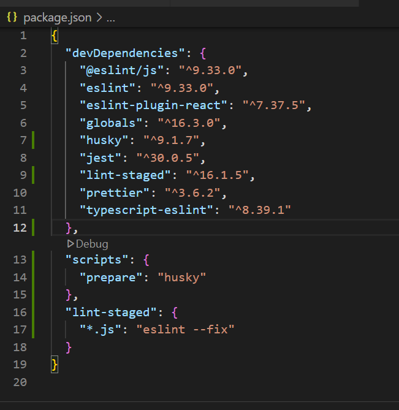
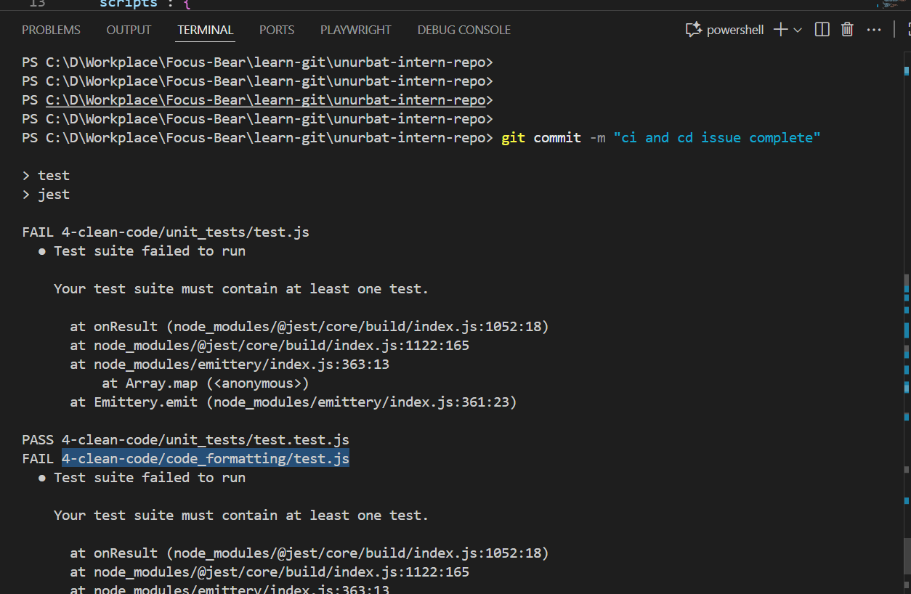

## What is CI/CD and Why is it Used?

CI/CD stands for Continuous Integration and Continuous Delivery (or Deployment). It's a set of practices and tools that help developers automatically build, test, and deliver code changes more frequently and reliably. With CI, every time you push code, automated tests and builds run to catch issues early. CD takes it a step further by automatically deploying the code to production or staging environments after it passes all checks.

I think CI/CD is important because it speeds up development, reduces manual errors, and makes it easier to release new features or fixes. It also gives teams confidence that their code works as expected, since everything is tested and deployed in a consistent, repeatable way.

I created markdown-lint-spellcheck yml file in github workflow and configured to spellcheck automatically for my repos each pull request.

then I installed husky for experiment git hooks

**What is Husky?**
Husky is a tool that makes it easy to use Git hooks in your project. With Husky, you can automatically run scripts like linters or tests before you commit or push code. I think it's really useful because it helps catch issues early and keeps your codebase clean by making sure everyone follows the same rules before changes are saved to the repository.

After installed and initialized the husky, I configured git hook for husky 

Then I configured lit-staged in my packege.json

After configured husky it run and checked all my test files after when I create commit 
