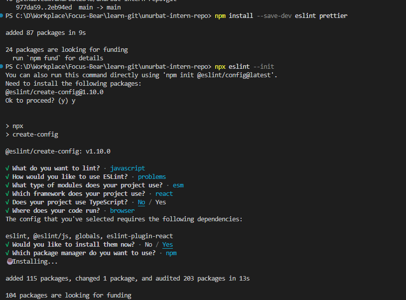
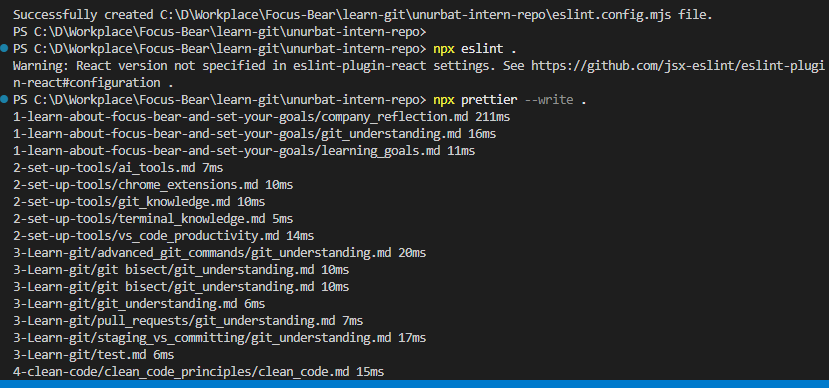
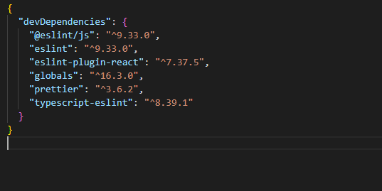
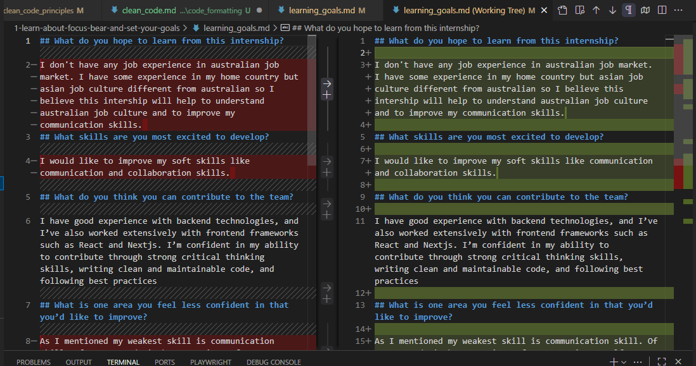
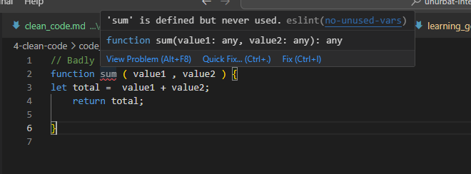
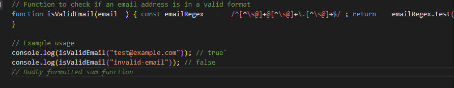
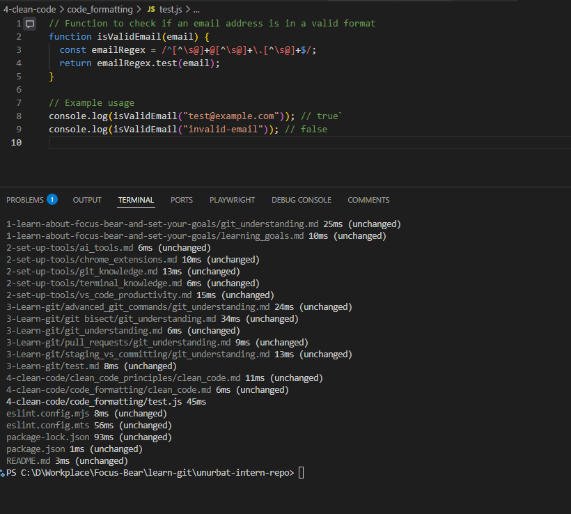

## Importance of Consistent Code Style

Consistent code style makes it easier for everyone on a team to read, understand, and maintain code. It helps prevent confusion, reduces bugs, and makes code reviews smoother because everyone follows the same rules.

## Airbnb JavaScript Style Guide

The Airbnb JavaScript style guide is a popular set of rules for writing clean and consistent JavaScript code. It covers everything from variable naming to spacing and best practices, making it a great reference for any project.

## Installing and Configuring ESLint and Prettier

To keep code style consistent, I installed ESLint and Prettier in my development environment. ESLint checks for code quality and style issues, while Prettier automatically formats code. Together, they help enforce rules and keep code looking clean.

After run Prettier it formats all our md file contents

## Why is code formatting important?

Code formatting is important because it makes code easier to read and understand for everyone. Well-formatted code helps prevent mistakes, speeds up code reviews, and makes it easier to spot bugs or inconsistencies.

## What issues did the linter detect?

The linter detected issues like missing semicolons, inconsistent spacing, and unused variables. It also pointed out places where the code didn't follow best practices or the chosen style guide.
For example I created small code to review prettier and it successfully detected issue.

## Did formatting the code make it easier to read?

Yes, formatting the code made it much easier to read. The code is now neatly organized, with consistent spacing and indentation, so it's quicker to understand what each part does.
For example when I created one small code with has bad format and after the pretteir run it formatted all code issues

After ran prettier : 
