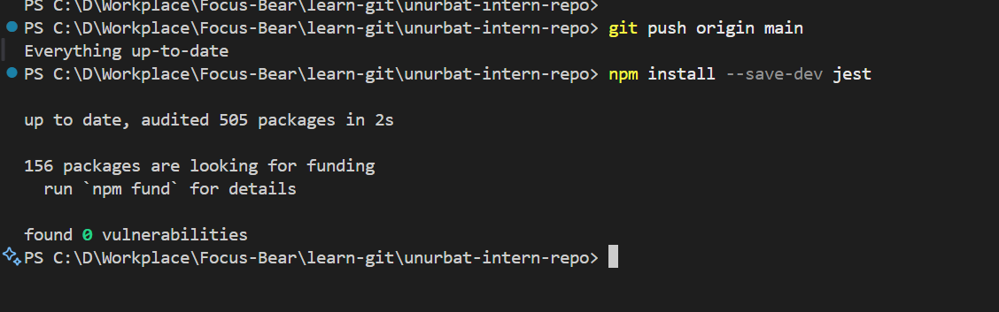
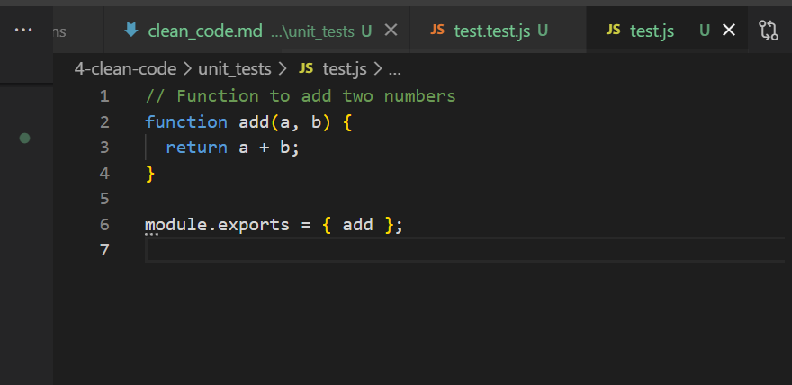
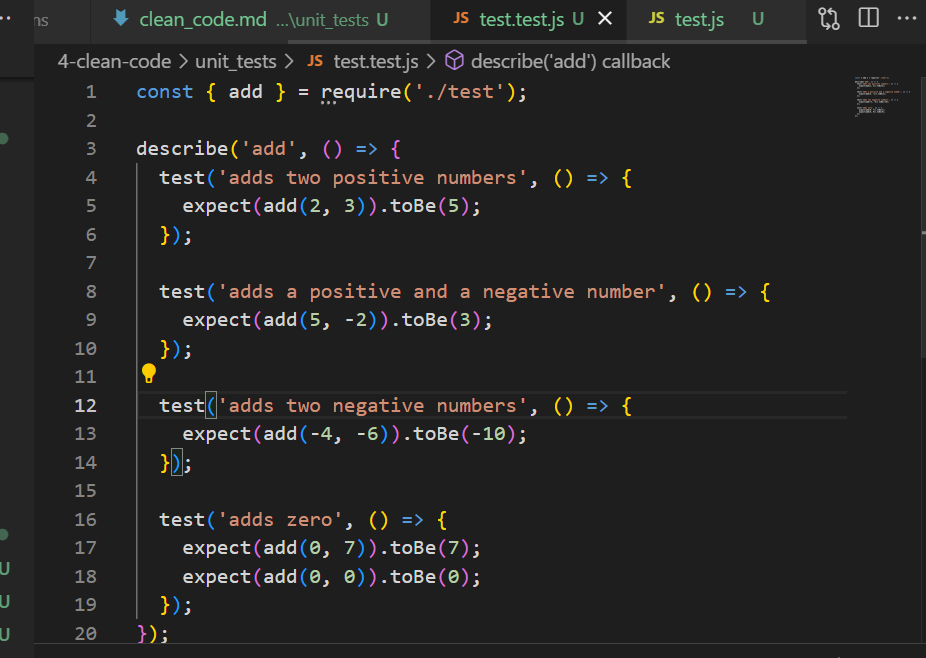
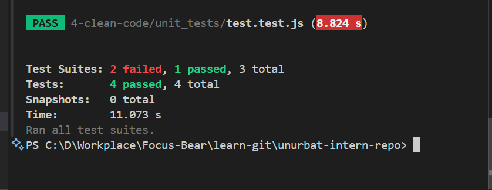

# Writing Unit Tests for Clean Code

Unit testing is important because it helps catch bugs early, before they make it into production. By testing small pieces of code in isolation, you can make sure each part works as expected. I think unit tests give you confidence to make changes or add new features, since you know you’ll be alerted if something breaks. They also make it easier to refactor code, improve documentation, and speed up the development process by reducing the time spent on manual testing and debugging.

## Choose a testing framework (e.g., Jest for JavaScript, PyTest for Python).

I choose Jest framework for unit testing and installed it

Then I created test.js file with has simple function

After that I created test.test.js file with has several unit tests

Finally here is my unit test results:

## Reflections

**How do unit tests help keep code clean?**
I think unit tests help keep code clean because they encourage you to write simple, focused functions that are easy to test. When you have tests, you can refactor or improve your code with confidence, knowing that the tests will catch any mistakes. For example, writing tests for the add function in test.js made me think about different scenarios, like adding negative numbers or zero, and made sure the function handled them correctly.

**What issues did you find while testing?**
While testing the add function with test.test.js, I realized there were edge cases I might have missed, such as adding zero or negative numbers. The tests also helped me spot any typos or logic errors right away. Overall, having these unit tests made the code more reliable and gave me confidence that the add function works as expected in different situations.
