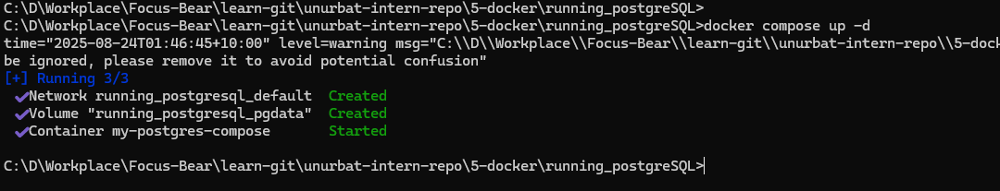

# Debugging & Managing Docker Containers

- `docker ps` command shows all running containers

 

- `docker inspect <container_id>` command shows specific container low-level information

- The `docker logs <container_id>` command displays the logs generated by a specific container, which is useful for debugging and monitoring container output.

- The `docker exec -it <container_name_or_id> bash` command lets me open an interactive shell inside a running container. For example, if my container is named `example`, I can run:

This gives me a terminal inside the container, so I can look around, check files, run commands, or debug issues directly. 

- The `docker-compose down` command stops and removes all containers defined in your `docker-compose.yml` file

- The `docker-compose up` command creates and starts containers as defined in the compose file.  

- The `docker stop <container_id>` command stops a running container gracefully. This is useful when I want to halt a container without removing it, allowing you to restart it later if needed.

- The `docker rm <container_id>` command removes one or more stopped containers from your system. This helps keep me Docker environment clean by deleting containers no longer need. Also I must stop a container before removing it.

## How can you check logs from a running container?

I use the `docker logs <container_name_or_id>` command to see the logs from a running container. If I want to follow the logs in real time, I add the `-f` flag: `docker logs -f <container_name_or_id>`. For multi-container setups with Docker Compose, I use `docker compose logs` or `docker compose logs -f`.

## What is the difference between docker exec and docker attach?

`docker exec` lets me run a new command (like a shell) inside a running container, without interfering with its main process. For example, `docker exec -it 1861d4452e73 bash` opens a new shell session. 

`docker attach`, on the other hand, connects my terminal directly to the main process of the container—so if I exit, it can stop the container. I almost always use `exec` for debugging, since it’s safer and more flexible.

## How do you restart a container without losing data?

To restart a container without losing data, I make sure to use Docker volumes for any important data (like databases). When I run `docker restart <container_name_or_id>`, the container stops and starts again, but the data in the volume stays safe. If I remove and recreate the container, as long as I use the same volume, my data will persist.

## How can you troubleshoot database connection issues inside a containerized NestJS app?

First, I check the logs for both the NestJS app and the database container to look for errors. Then, I use `docker exec -it <container_name_or_id> bash` to get a shell inside the NestJS container and try to ping the database host or use tools like `psql` or `nc` to test the connection. I double-check environment variables (like DB_HOST, DB_PORT, DB_USER, DB_PASSWORD) and make sure the containers are on the same Docker network. If the database is running in another container, I use the service name (not localhost) as the host. Finally, I check for firewall or port mapping issues.