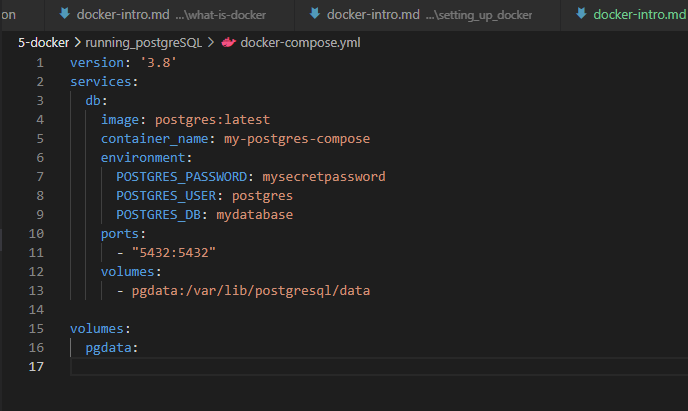
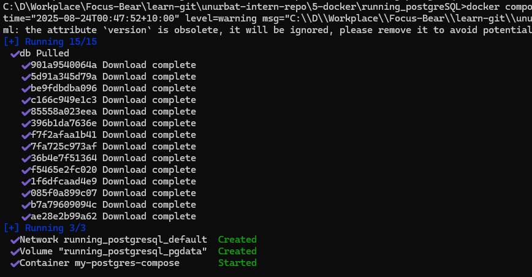
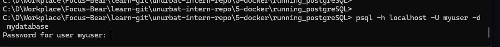

# Running PostgreSQL in Docker

1. Here is my  `docker-compose.yml` file 



2. Then I started the PostgreSQL service in the background.




3. I connected to PostgreSQL using a following command: 



4. **How volumes persist PostgreSQL data:**
The `volumes` section in the compose file creates a named volume (`pgdata`). This means all the database files are stored outside the container. If I stop, remove, or recreate the container, my data is still safe in the volume. Only if I delete the volume itself will the data be lost. This is the best way to make sure my database data survives container restarts or upgrades.


## What are the benefits of running PostgreSQL in a Docker container?

Running PostgreSQL in a Docker container makes setup and management much easier for me. I don’t have to install PostgreSQL directly on my machine or worry about version conflicts. I can quickly spin up or tear down databases for different projects, and everything runs in an isolated environment. This also makes it simple to share my setup with others—anyone can use my `docker-compose.yml` file to get the same environment.

## How do Docker volumes help persist PostgreSQL data?

Docker volumes store the database files outside the container, so my data isn’t lost if I stop, remove, or recreate the container. As long as I don’t delete the volume itself, my database data will always be there, even after upgrades or container rebuilds. This is essential for keeping my data safe and persistent.

## How can you connect to a running PostgreSQL container?

I can connect to a running PostgreSQL container using tools like pgAdmin, DBeaver, or the `psql` command-line tool. I just use the host `localhost`, port `5432`, user `postgres`, and the password I set in my compose file. For example:

```sh
psql -h localhost -U postgres -d mydatabase
```
Then I enter the password when prompted. GUI clients work the same way—just enter the same connection details.
