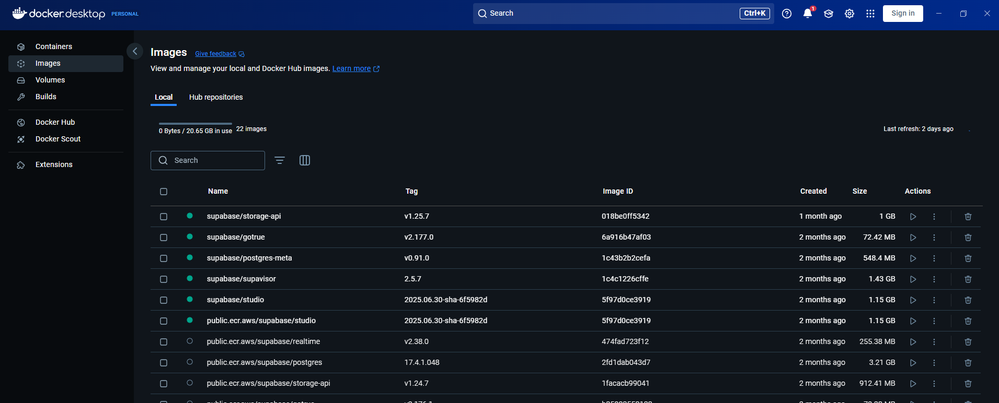
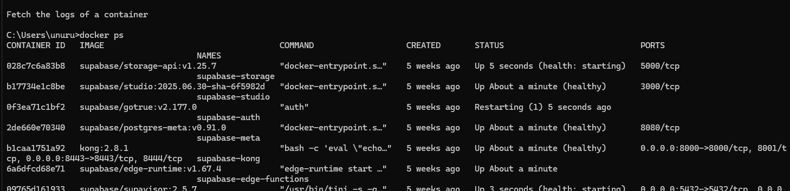
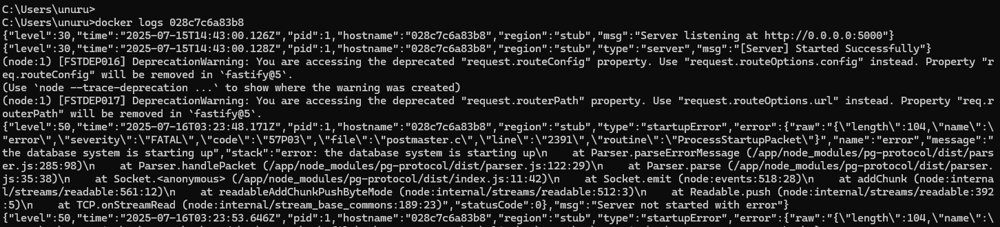
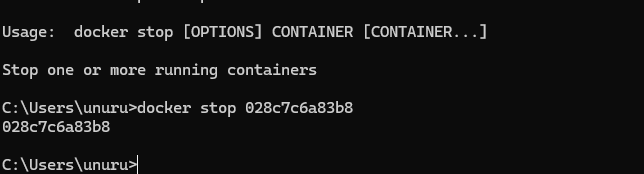
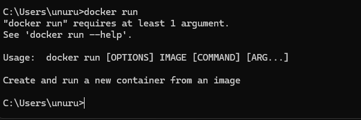
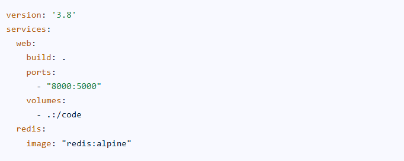

# Setting Up Docker and Docker Compose
I already installed docker in my windows machine

docker ps command shows all container details

docker log <container_id> command shows exact container logs

docker stop <container_id > command will stop that exact container

## What is the difference between docker run and docker-compose up?

docker run command will create container from image

docker compose command
The `docker compose` command is used to start and manage multiple containers defined in a `docker-compose.yml` file. Instead of running each container one by one, I can define all my services (like a backend, database, and frontend) in one file and start them together with `docker compose up`. This makes it much easier to set up and manage multi-container applications.
Here is the example of the docker compose file. This example defines two services: a web service that builds an image from a local Dockerfile and exposes a port, and a redis service that uses a pre-built Redis image.

## How does Docker Compose help when working with multiple services?
When I’m working on a project that needs several services—like a backend API, a database, and maybe a frontend—Docker Compose makes my life a lot easier. I can define all the services, their configurations, and how they connect to each other in a single `docker-compose.yml` file. Then, with just one command, I can start or stop everything together. This saves me from having to run and configure each container manually, and it ensures all the services work together as expected. It’s especially helpful for local development and testing, since I can quickly spin up or tear down the whole environment.

## What commands can you use to check logs from a running container?

To check logs from a running container, I usually use the following commands:

- `docker logs <container_id or name>` – This shows the logs for a specific container. I use this most often to see what’s happening inside my app or to debug errors.
- `docker logs -f <container_id or name>` – The `-f` flag lets me follow the logs in real time, similar to `tail -f` for files.
- `docker compose logs` – If I’m using Docker Compose, this command shows logs from all services defined in my `docker-compose.yml` file.
- `docker compose logs -f` – This lets me follow logs from all services in real time.

These commands help me monitor and debug my containers while they’re running.

## What happens when you restart a container? Does data persist?

When I restart a container, any data stored inside the container’s filesystem (like files written to disk) will still be there, because the container’s state is preserved during a restart. However, if I remove or delete the container and create a new one from the same image, that data will be lost unless I use Docker volumes. Volumes are special storage areas that exist outside the container, so even if I remove or recreate containers, the data in the volume will persist. That’s why I always use volumes for databases or anything that needs to keep data between container restarts or rebuilds.
