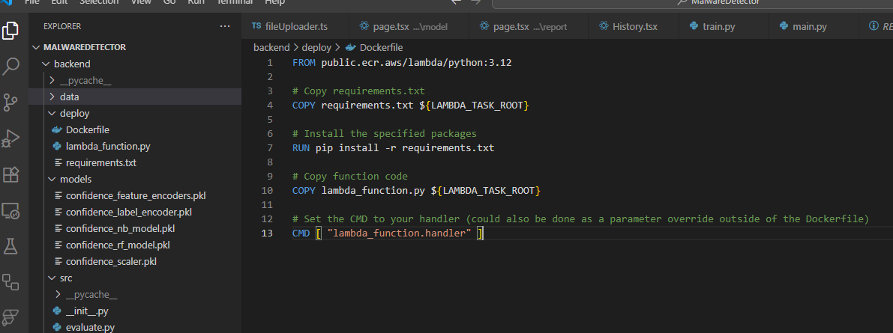
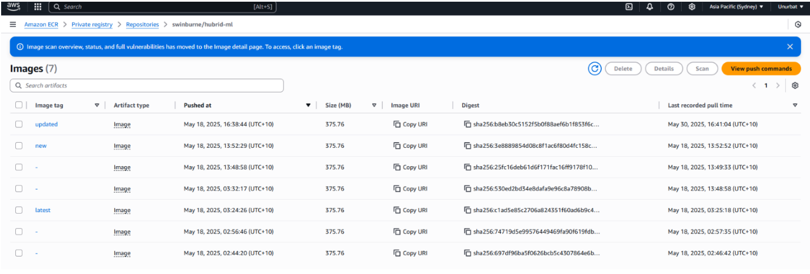

# What is Docker and Why Use It?

From my perspective, Docker is a tool that makes it much easier for me to package and run applications. With Docker, I can put my app and everything it needs—like libraries and dependencies—into a container. This means I don’t have to worry about setup issues when moving my app between different computers or cloud services. It just works the same everywhere Docker is installed.
## How does Docker differ from a virtual machine?
When I first learned about Docker, I compared it to virtual machines (VMs). Both let me run apps in isolated environments, but VMs run a whole operating system and pretend to be a separate computer. This uses a lot of resources and takes longer to start. Docker containers, on the other hand, share the host system’s OS and are much lighter and faster. I can run more containers at once, and they start up almost instantly. For me, Docker feels much more efficient and portable than using traditional VMs for most of my projects.

## Why is containerization useful for a backend like Focus Bear’s?
I think Docker will help automate continuous deployment and continuous testing architectures, similar to the Focus Bear application. For example, in the previous semester, I worked on a malware detection ML project where I used Docker to build and push an image to AWS ECR, and then deployed that image to a Lambda function.

## How do containers help with dependency management?

For me, one of the biggest advantages of using containers is how they handle dependencies. For example, when I was working on my ML project, I tried to deploy a Python script directly to AWS Lambda, but after installing all the dependencies, the deployment exceeded the Lambda file size limit. By packaging everything into a Docker image, I was able to include all the necessary dependencies and deploy successfully without hitting those limits. Docker made the whole process much smoother and solved my problem.

## What are the potential downsides of using Docker?
While Docker has made my development process much easier, I’ve also run into some challenges. There was a learning curve at the beginning, especially when it came to understanding Docker concepts and debugging issues. Sometimes, I notice a bit of performance overhead, particularly when running many containers or using Docker on Windows or Mac. As projects grow, managing lots of containers, networks, and volumes can get complicated. Security is another concern—if I’m not careful with how I build images or handle secrets, there could be risks. Finally, dealing with persistent data, like databases, requires extra setup to make sure data isn’t lost when containers are stopped or removed.