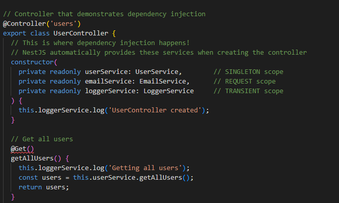
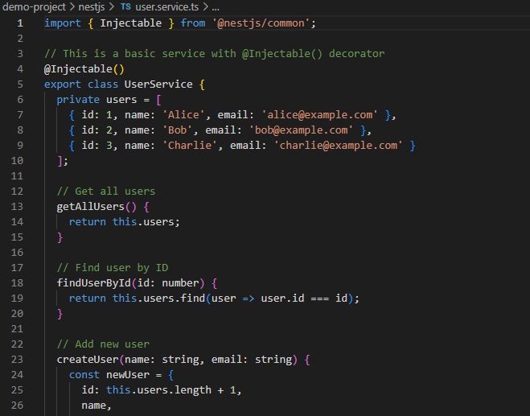
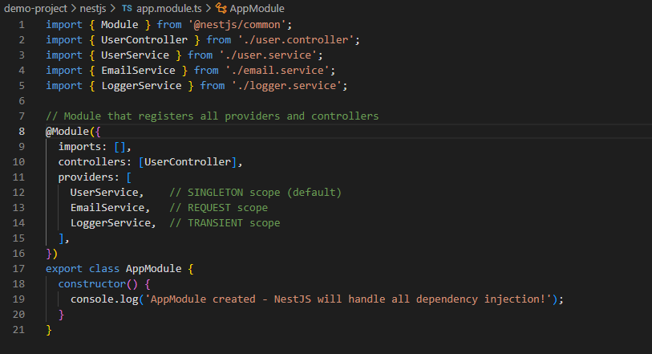

# Dependency Injection in NestJS

## How does dependency injection improve maintainability?

For me, dependency injection makes my code easier to change and fix. If I want to swap out one part for another, I don’t have to rewrite everything. It also helps me test my code because I can use fake versions of things when I need to.

## What is the purpose of the @Injectable() decorator?

When I add @Injectable() to a class, it tells NestJS that this class can be used as a service or provider. That way, NestJS knows it can give this class to other parts of my app.

## What are the different types of provider scopes, and when would you use each?

There are three main scopes: default (singleton), request, and transient. Singleton means there’s only one instance for the whole app (I use this most of the time). Request scope makes a new instance for every request, which is good if I need to keep things separate for each user. Transient scope makes a new instance every time it’s needed.

## How does NestJS automatically resolve dependencies?

NestJS looks at the constructor of my class and sees what other classes it needs. If those classes are marked with @Injectable() and are in the module, NestJS creates them and gives them to my class automatically.
