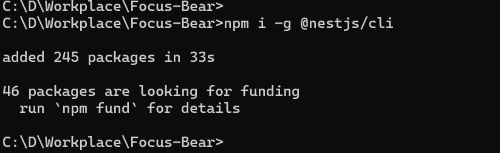
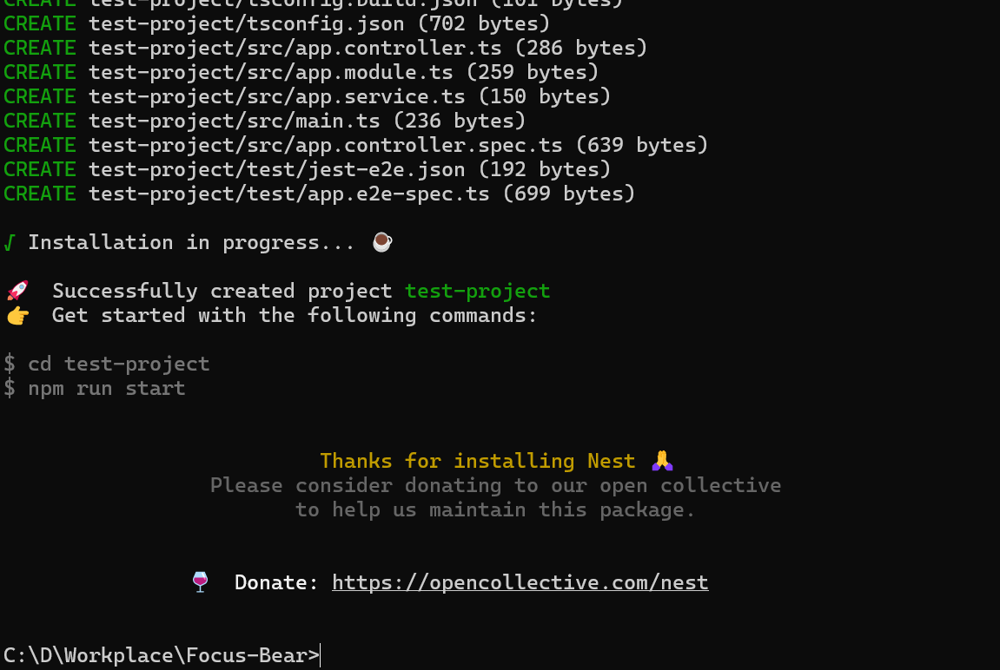
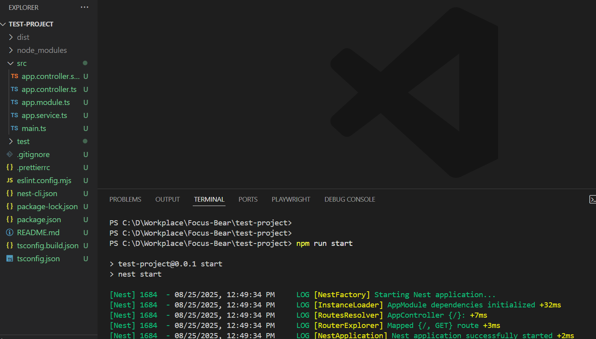
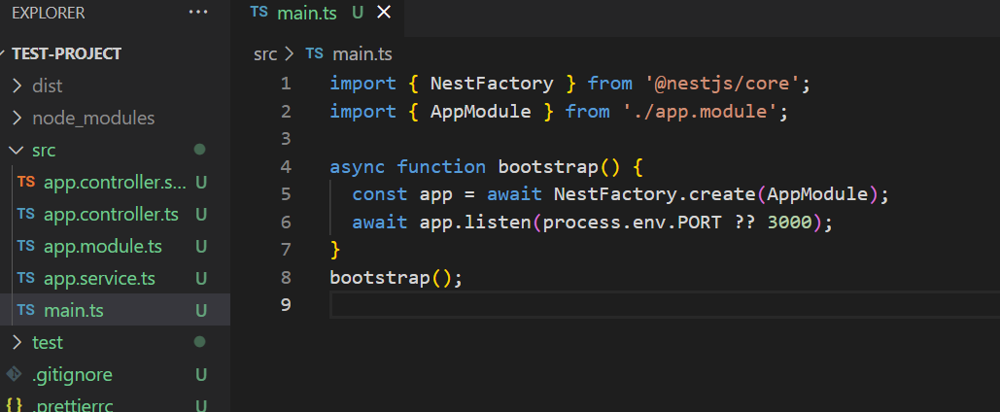
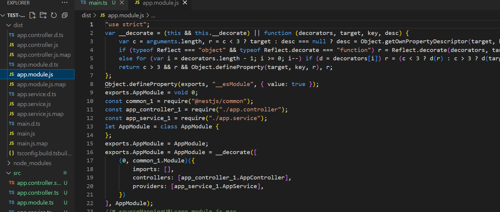

# Setting Up a NestJS Project
I followed the instruction on https://docs.nestjs.com/ and create new nestjs project. 
Firs I installed nexsjs cli by following command: 

Then created new test project

## What files are included in a default NestJS project?

When I make a new NestJS project, I see files like `main.ts`, `app.module.ts`, `app.controller.ts`, and `app.service.ts`. There are also folders for source code and some files for settings, like `package.json` and `tsconfig.json`.

## How does main.ts bootstrap a NestJS application?

The `main.ts` file is where my app starts. It tells NestJS to start running and listen for requests.

## What is the role of AppModule in the project?

The `AppModule` is like the main organizer. It puts together all the parts of my app so they work as one.

## How does NestJS structure help with scalability?

NestJS makes it easy to add more features by keeping everything organized in different files and folders. This helps my app grow without getting messy.