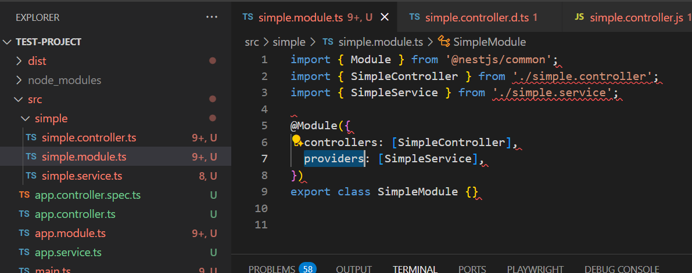
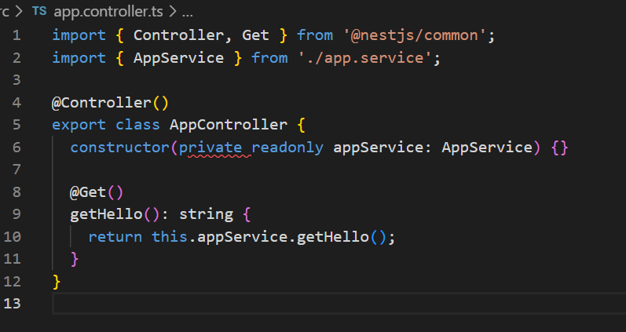
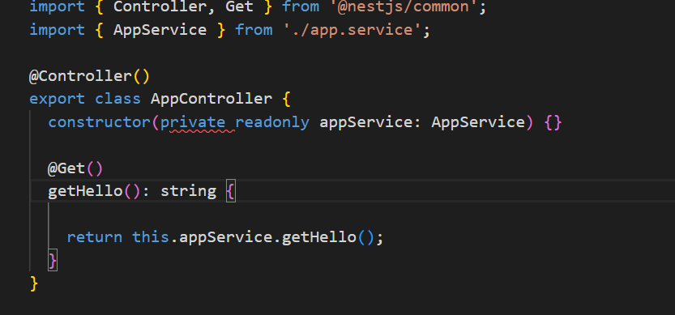
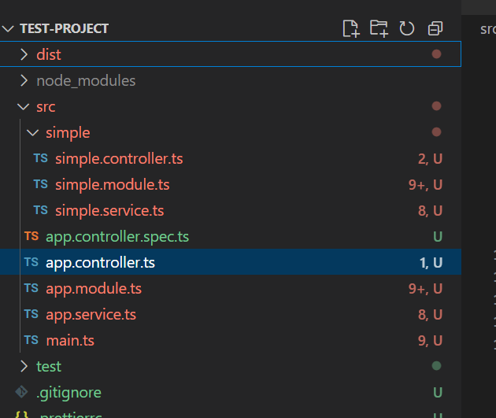

# Understanding Modules, Controllers, and Providers in NestJS

## What is the purpose of a module in NestJS?
Modules are used for organizing related components, such as controllers and providers, into cohesive blocks of functionality. They help structure your application by grouping features together, making the codebase easier to manage and scale.
For example, in a test project, I created a simple module where both the controller and service are registered within the module’s configuration. This setup allows the module to manage its own functionality and dependencies, demonstrating how modules organize related components in NestJS.

## How does a controller differ from a provider?

A controller handles requests from users, like when someone visits a website. A provider (like a service) does the behind-the-scenes work, like getting data or doing calculations.

## Why is dependency injection useful in NestJS?

Dependency injection lets me use things like services in my controllers without making them myself. NestJS gives me what I need, so my code is easier to test and change.

For  example in my SimpleController, I have this constructor:

This is dependency injection. NestJS automatically provides an instance of SimpleService to the controller.
I can easily swap SimpleService with a mock or different implementation for testing.
For example, in a test, I can provide a fake service:

const fakeService = { getHello: () => 'Fake Hello' };
const controller = new SimpleController(fakeService as any);

## How does NestJS ensure modularity and separation of concerns?

NestJS keeps everything in its own place—controllers, services, and modules—so each part does its own job. This makes my app easier to build, fix, and grow. For example, my SimpleModule contains only the controller and service related to the “simple” feature.

