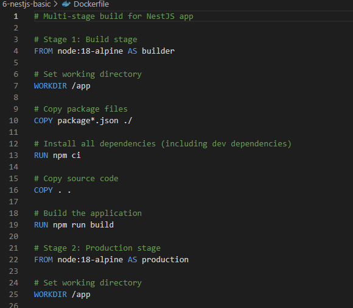
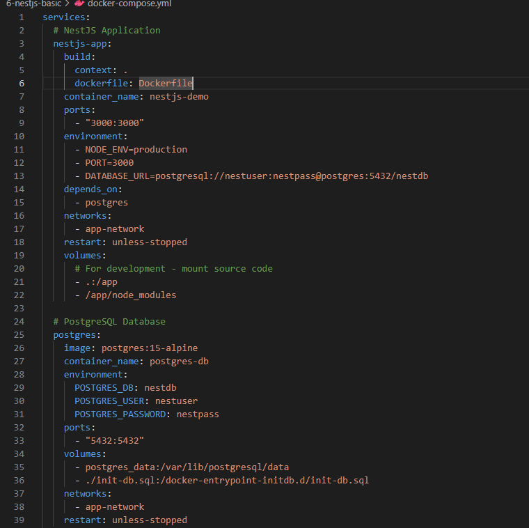
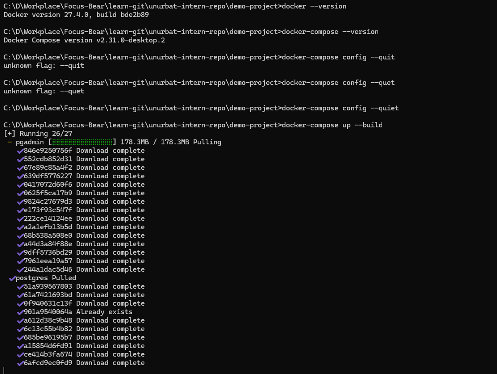

# Using Docker for NestJS Development

## How does a `Dockerfile` define a containerized NestJS application?

A Dockerfile is like a recipe that tells Docker how to build my app. It lists all the steps - what base image to use, where to put my code, what commands to run, and how to start my app. It's like writing instructions for someone else to set up my project exactly the same way.
Here is the dockerfile that I created in demo project:

## What is the purpose of a multi-stage build in Docker?

Multi-stage builds help me make smaller, faster containers. I use one stage to build my app with all the development tools, then copy just the finished app to a clean stage. It's like baking a cake - I need lots of ingredients and tools to make it, but I only serve the final cake.
I also configured multi stage build in docker file:

## How does Docker Compose simplify running multiple services together?

Docker Compose lets me start my app and database with just one command instead of running each container separately. I define all my services in one file and Docker handles connecting them together. It's way easier than remembering multiple docker run commands.
Here is the docker compose file: 

## How can you expose API logs and debug a running container?

I can see what's happening inside my container using `docker logs container-name` to check the output. If I need to go inside the container, I use `docker exec -it container-name sh` to open a shell. The health check I added also helps me know if something goes wrong.
Build and run containers for my demo project:
