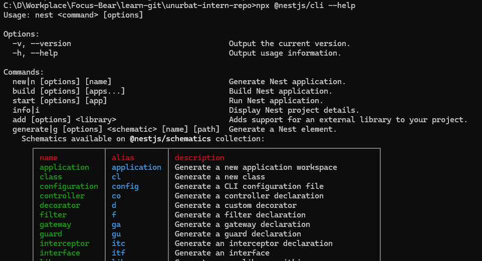
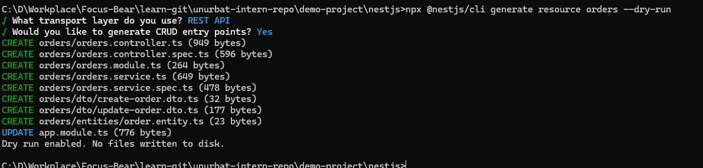

# Using NestJS CLI for Scaffolding

## How does the NestJS CLI help streamline development?

The NestJS CLI makes everything super fast for me. Instead of writing all the boilerplate code by hand, I just type one command and get everything I need. It's like having a coding assistant that knows exactly what files to create.

## What is the purpose of `nest generate`?

The `nest generate` command creates different parts of my app automatically. I can make controllers, services, modules, and more with just one line. It saves me tons of time and makes sure I don't forget anything important.
For example: let's create product module, controller and service

## How does using the CLI ensure consistency across the codebase?

When I use the CLI, all my files look the same and follow the same patterns. Everyone on my team gets the same structure, so we don't have to worry about different coding styles. It's like having a template that everyone uses.

Shows what would be created without actually creating files

## What types of files and templates does the CLI create by default?

The CLI creates the main file I need plus a test file. For a service, I get `products.service.ts` and `products.service.spec.ts`. It also updates my module automatically to include the new stuff. Everything comes with the right decorators and imports already set up.

