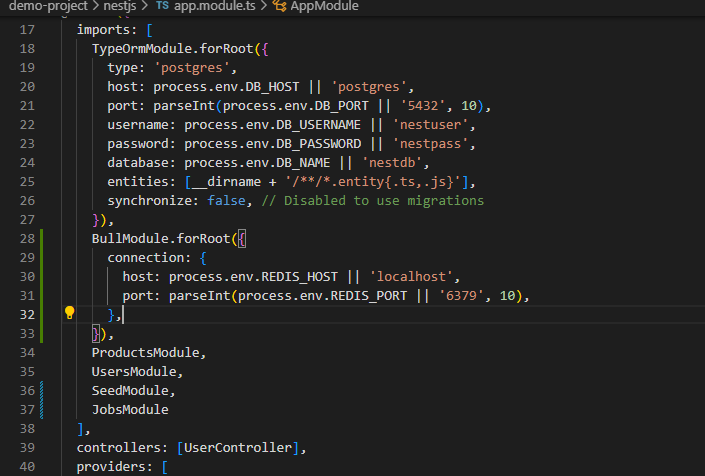
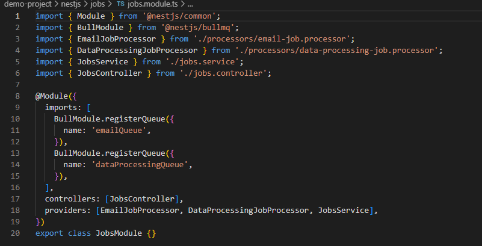
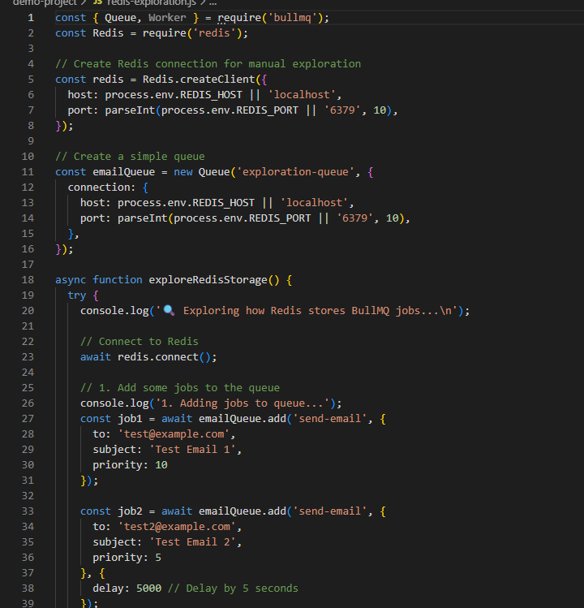
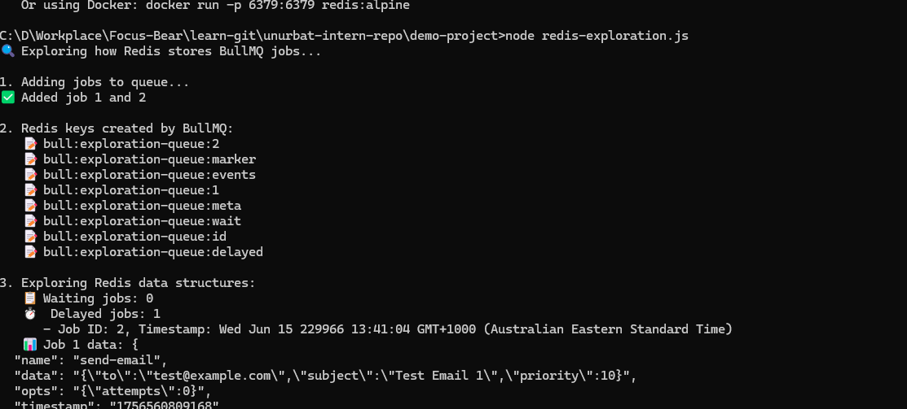
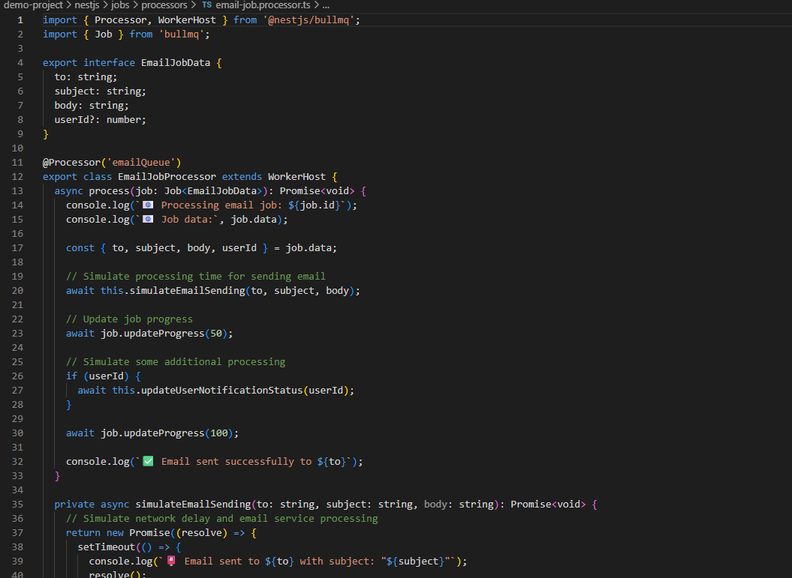
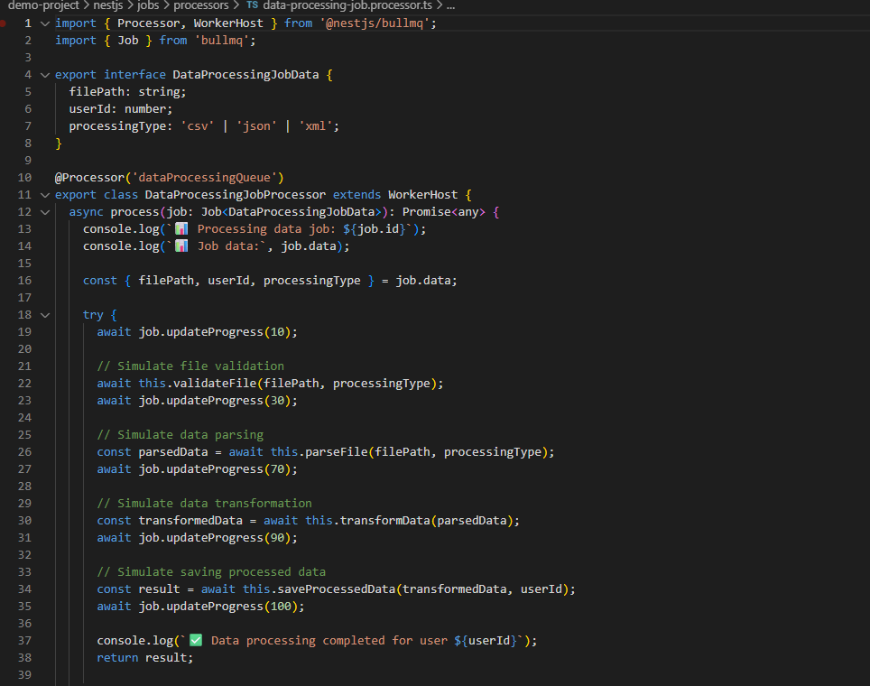
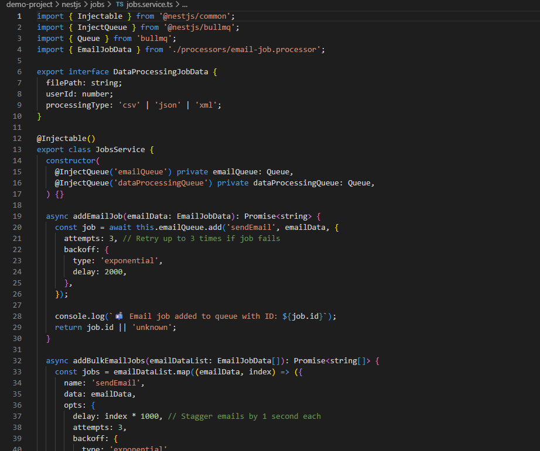
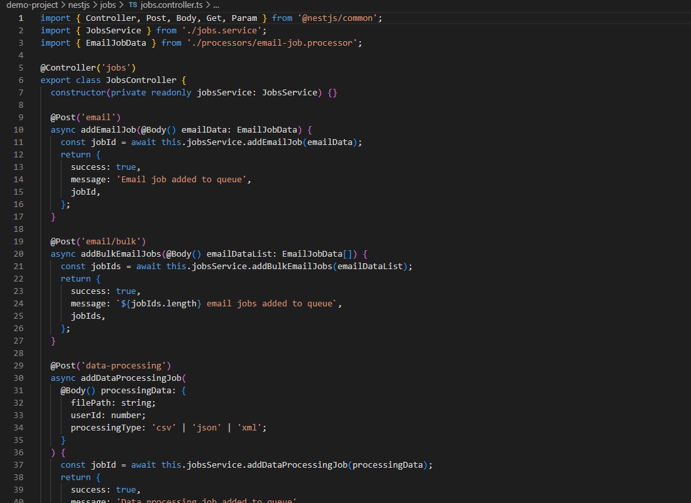

# Background Jobs with BullMQ & Redis in NestJS

## Why is BullMQ used instead of handling tasks directly in API requests?
When you handle time-consuming tasks directly in API requests, your users end up waiting ages for responses. It's like being stuck behind someone at a coffee shop who's ordering 20 different drinks - everyone else has to wait.

BullMQ solves this by moving heavy tasks to the background. Instead of making users wait for an email to send or a file to process, the API immediately responds "we got your request" and handles the work behind the scenes. This keeps your application responsive and prevents timeouts.

Here is my BullMQ configuration in the main app module:

Here is my jobs module with queue registrations:

## How does Redis help manage job queues in BullMQ?
Redis acts as the brain that organizes and tracks all your background jobs. BullMQ uses Redis data structures to create a sophisticated job management system.

Redis stores jobs in different lists - waiting jobs, active jobs, completed jobs, and failed jobs. It's like having different boxes where you sort your tasks by status. Redis also uses sorted sets for delayed jobs and hashes to store individual job data.

Here is my Redis exploration script showing how jobs are stored:

Here is the output showing Redis keys and job data:

## What happens if a job fails? How can failed jobs be retried?
BullMQ has smart retry logic built-in. When a job fails, it doesn't just give up - it tries again with increasingly longer delays between attempts.

The system automatically moves failed jobs back to the waiting queue and tries them again. Each retry waits longer than the last one (2 seconds, then 4 seconds, then 8 seconds) to avoid overwhelming failing services. After all attempts are used up, the job moves to the failed queue permanently.

Here is my email job processor with retry configuration:

Here is my data processing job processor handling failures:

## How does Focus Bear use BullMQ for background tasks?
Focus Bear uses BullMQ for several time-consuming operations that would slow down the user interface if handled directly in API requests.

Focus Bear processes notification sending, analytics reporting, data synchronization, and scheduled tasks in the background. This keeps the app responsive while handling important work behind the scenes. Users don't have to wait for reports to generate or notifications to process.

Here is my jobs service showing different types of background tasks:

Here is my API controller for managing background jobs:

Here is a demonstration of the background job processing in action:
