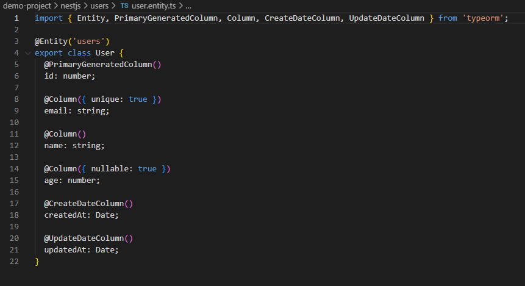

# Connecting to PostgreSQL with TypeORM in NestJS

## How does `@nestjs/typeorm` simplify database interactions?

`@nestjs/typeorm` acts like a smart translator between JavaScript code and the database. Instead of writing raw SQL queries like `SELECT * FROM users WHERE id = 1`, I can just write `this.usersRepository.findOne({ where: { id } })`. The package handles all dependency injection automatically - when I use `@InjectRepository(User)`, NestJS gives me a repository that's already connected to my database.

Here's my TypeORM configuration in app.module.ts:

The configuration was straightforward - just pass in database credentials and tell it where entities are located. TypeORM handles all the connection management behind the scenes.

## What is the difference between an entity and a repository in TypeORM?

An **entity** is like a blueprint that defines what data looks like. My User entity defines the structure with decorators like `@Entity()`, `@PrimaryGeneratedColumn()`, and `@Column()` that help TypeORM map the class to database columns.

Here's my User entity:

A **repository** is like a toolbox with methods for working with that entity. When I inject `Repository<User>`, I get pre-built methods like `save()`, `find()`, `findOne()`, `update()`, and `delete()`.

Here's my Users service using the repository pattern:

## How does TypeORM handle migrations in a NestJS project?

I used `synchronize: true` in my configuration, which automatically creates and updates database tables based on entities. TypeORM sees my User entity and creates a `users` table with all the right columns. This is convenient for development but not recommended for production.

For production, you'd use proper migrations - scripts that describe exactly how to change database structure. Migrations are repeatable and reversible, making them much safer than automatic synchronization when you have real user data.

Here's my Users module with TypeORM feature registration:

## What are the advantages of using PostgreSQL over other databases in a NestJS app?

PostgreSQL offers several key advantages: it's extremely reliable with excellent support for concurrent connections and transactions. It supports advanced data types like JSON and arrays that other databases lack. PostgreSQL is optimized for complex queries and large datasets, making it perfect for scaling applications.

Here's my Users controller with REST endpoints:

PostgreSQL is open source with no licensing fees and has huge community support. It works seamlessly with TypeORM and is ACID compliant, guaranteeing reliable database operations. For enterprise applications like Focus Bear that need to handle user data reliably, PostgreSQL provides the performance and features needed.

Here's the complete project structure:
