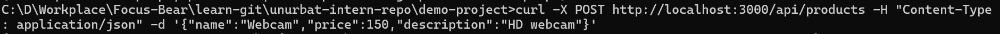

# Creating REST APIs with NestJS

## What is the role of a controller in NestJS?
Controllers handle HTTP requests like GET, POST, PUT, and DELETE. They're like waiters in a restaurant - they take your order (request) and bring you food (response), but they don't cook the food themselves. In my ProductsController, I created endpoints for all CRUD operations using decorators like `@Get()`, `@Post()`, `@Put()`, and `@Delete()`. For example, when someone visits `/products`, the `@Get()` decorator tells NestJS to call my `getAllProducts()` function.
Here are my demo product API.
GET API - show products list and specific product details :

POST API  - creates new product

PUT API - update product information

DELETE API - deletes product

## How should business logic be separated from the controller?
Controllers should only handle requests and responses, while services do the actual work. Think of it like this: the controller is the cashier who takes your order, but the service is the chef who makes the food. In my example, the ProductsController receives requests and calls ProductsService methods, but the ProductsService actually manages the product data, creates new products, updates them, and deletes them.
Here is my product API controller:

## Why is it important to use services instead of handling logic inside controllers?
Services make your code reusable and easier to test. If I put all my product logic in the controller, I'd have to copy it everywhere I need it. But with services, multiple controllers can use the same ProductsService. Also, if I want to change how products are stored (maybe switch from an array to a database), I only need to update the service, not every controller that uses it.
Here is my product service: 

## How does NestJS automatically map request methods (GET, POST, etc.) to handlers?
NestJS uses decorators (those @ symbols) to connect HTTP methods to functions. When I write `@Get()` above a function, NestJS knows to call that function for GET requests. When I write `@Post()`, it handles POST requests. It's like putting labels on boxes - NestJS reads the labels and knows which box (function) to open for each type of request. I can even add parameters like `@Get(':id')` to capture URL parts automatically.

