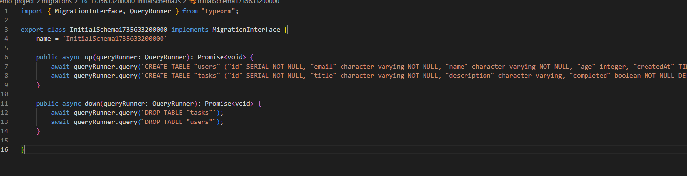

# Seeding & Migrations in TypeORM

## What is the purpose of database migrations in TypeORM?

Database migrations are scripts that manage changes to our database schema over time. They work like version control for your database structure. When I need to add a new column, create a table, or modify existing fields, I create a migration instead of manually changing the database.

Here's my migration configuration:

TypeORM migrations have `up()` and `down()` methods. The `up()` method applies changes, while `down()` reverses them. This ensures I can move forward or backward through database changes safely.

Here's my initial schema migration:

## How do migrations differ from seeding?

Migrations change the database structure (schema), while seeding adds data to existing tables. Think of migrations as building the house (creating rooms, adding doors) and seeding as furnishing it (adding furniture and decorations).

Here's a migration that adds new columns to the tasks table:

Migrations are required for the application to work properly, while seeding is optional and typically used for development or testing environments.

Here's my updated Task entity with the new fields:

## Why is it important to version-control database schema changes?

Version control for database changes prevents chaos when working in teams. Without migrations, developers might have different database structures locally, leading to errors. Migrations ensure everyone has the same database schema.

Here's my seed service for populating test data:

When I deploy to production, migrations can be run automatically to update the database schema. This eliminates the need to manually execute SQL commands on production servers, reducing the risk of human error.

## How can you roll back a migration if an issue occurs?

TypeORM provides rollback functionality through the `down()` method in each migration. If a migration causes problems, you can run `npm run migration:revert` to execute the `down()` method and undo the changes.

Here are the migration scripts I added to package.json:

The rollback system works like a stack - the most recent migration is reverted first. Each migration must implement both `up()` and `down()` methods to be properly reversible. This safety net allows teams to quickly recover from migration issues without losing data.

Here's the complete project structure with migrations and seeding:
