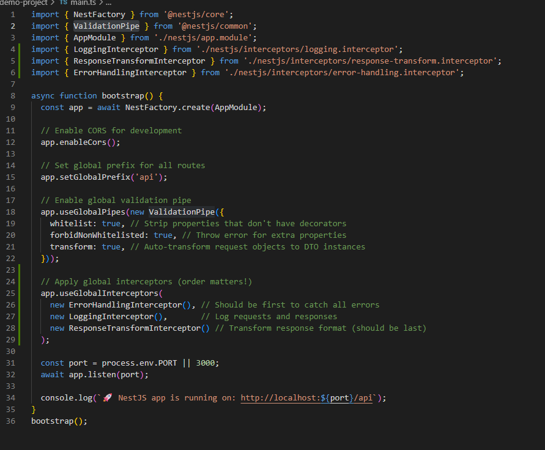
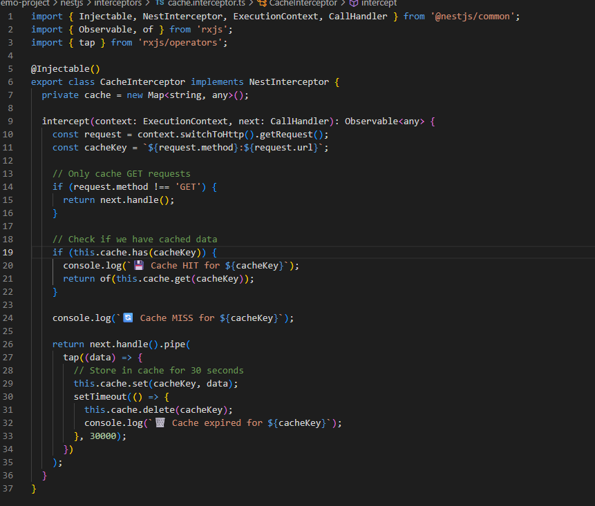
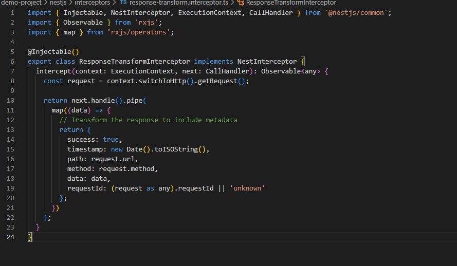
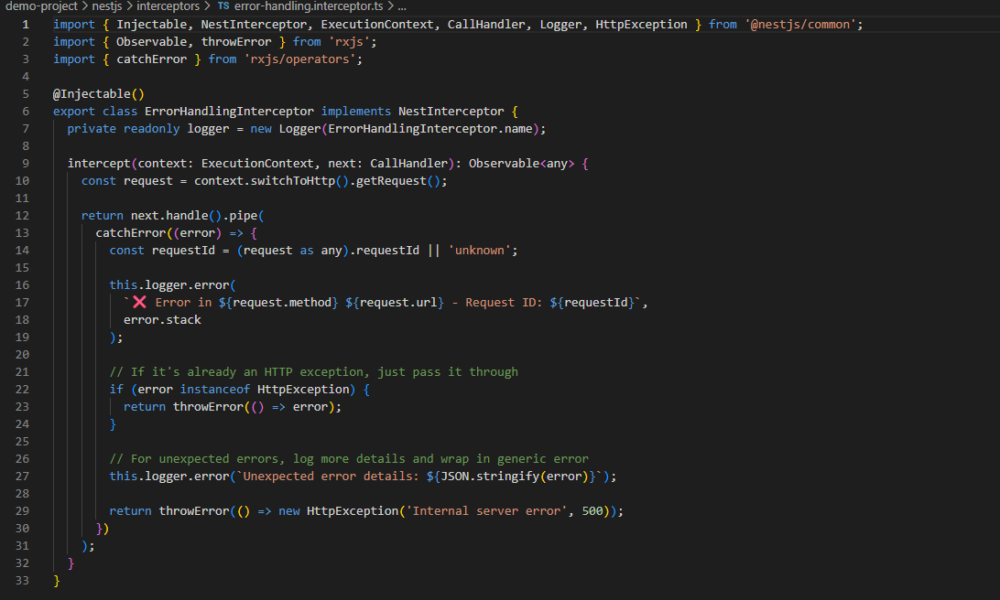

# Using Interceptors & Middleware in NestJS

## What is the difference between an interceptor and middleware in NestJS?
Middleware runs first and handles basic stuff like adding headers, checking authentication, or logging requests. Interceptors run later and can do more complex things like transforming responses, handling errors, or caching data. In my implementation, I used middleware to add security headers and request IDs, while interceptors handled logging, response transformation, and caching.

## When would you use an interceptor instead of middleware?
In my project, I used the CacheInterceptor to store and retrieve GET request results, which middleware can't do because it runs too early in the process. I also used ResponseTransformInterceptor to wrap all responses with extra metadata like timestamps and request IDs. Middleware is better for simple tasks like adding headers or basic request preprocessing, while interceptors are perfect for response manipulation, error handling, and business logic that needs to run after the controller method executes.

## How does LoggerErrorInterceptor help?
My ErrorHandlingInterceptor acts like a safety net that catches any errors that happen during request processing. It logs detailed error information including the request ID, method, URL, and full error stack trace, which makes debugging much easier. When an error occurs, it captures it before it reaches the client and can transform it into a user-friendly response. For example, when I tested a request for a non-existent product (ID 999), the interceptor caught the HttpException, logged the error with the request ID "fde4f09d", and ensured the client got a clean error response instead of a messy server crash.
