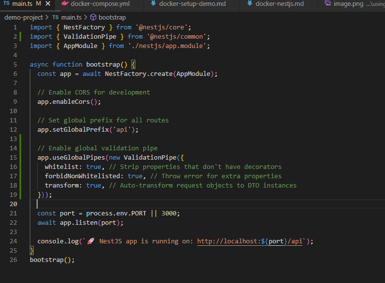
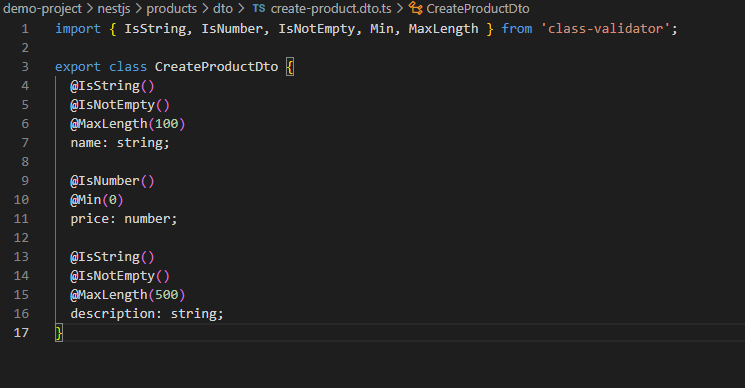
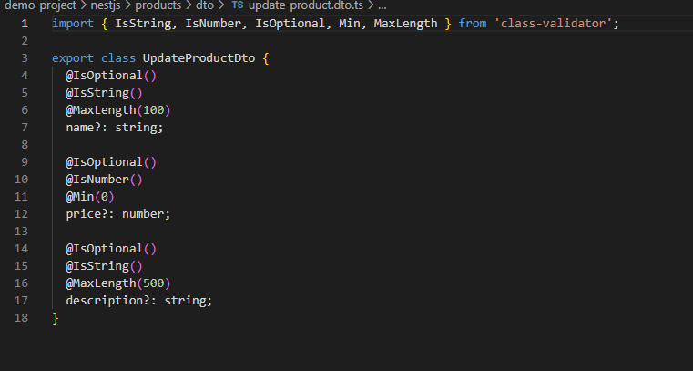
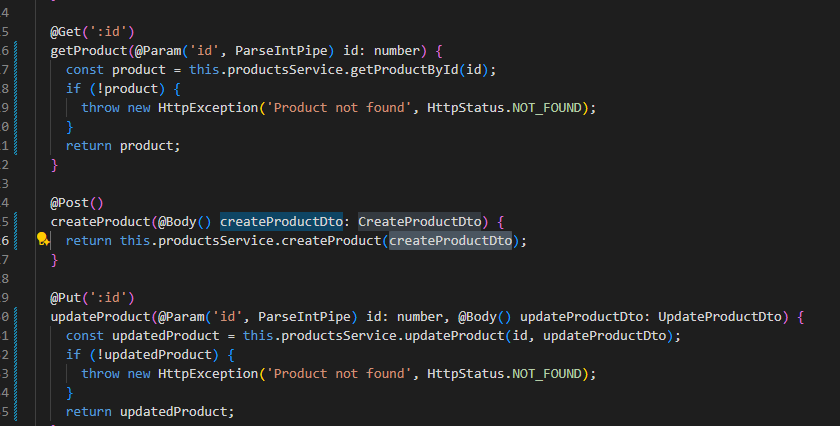

# Validating Requests with Pipes in NestJS

## What is the purpose of pipes in NestJS?
Pipes are like quality control inspectors at a factory - they check and transform data before it gets processed. In my products API, I used pipes to make sure all incoming data is valid before it reaches my controller methods. Pipes can do two main things: validate data (like checking if a price is a positive number) and transform data (like converting a string "123" into the actual number 123). I implemented ValidationPipe globally to automatically validate all request data using my DTOs.

## How does ValidationPipe improve API security and data integrity?
ValidationPipe acts like a bouncer at a club - it only lets in the right kind of data and rejects anything suspicious. In my implementation, it prevents bad data from reaching my business logic by checking all the validation rules I defined with decorators like `@IsString()` and `@Min(0)`. For example, when someone tries to create a product with a negative price or empty name, ValidationPipe catches it and returns a clear error message instead of letting broken data into my database. This keeps my data clean and prevents potential security issues from malicious input.

## What is the difference between built-in and custom pipes?
Built-in pipes are like having pre-made tools in a toolbox - NestJS gives you ready-to-use pipes like `ParseIntPipe` which I used to automatically convert URL parameters from strings to numbers. Custom pipes are like making your own specialized tool for a specific job. While I used built-in ValidationPipe for general validation, I could create custom pipes for special business rules like checking if a product name is unique. Built-in pipes handle common tasks, while custom pipes let you add your own specific validation logic.

## How do decorators like @IsString() and @IsNumber() work with DTOs?
These decorators are like labels that tell ValidationPipe what to check for each property. In my CreateProductDto, when I put `@IsString()` above the name field, it's like putting a sign that says "this must be text only." ValidationPipe reads these decorators and automatically runs the appropriate checks. I also used `@Min(0)` for price to ensure no negative values, and `@MaxLength(100)` for name to prevent extremely long product names. The decorators work together - so a field might need to be a string AND not empty AND under 100 characters, and ValidationPipe checks all these rules automatically.

