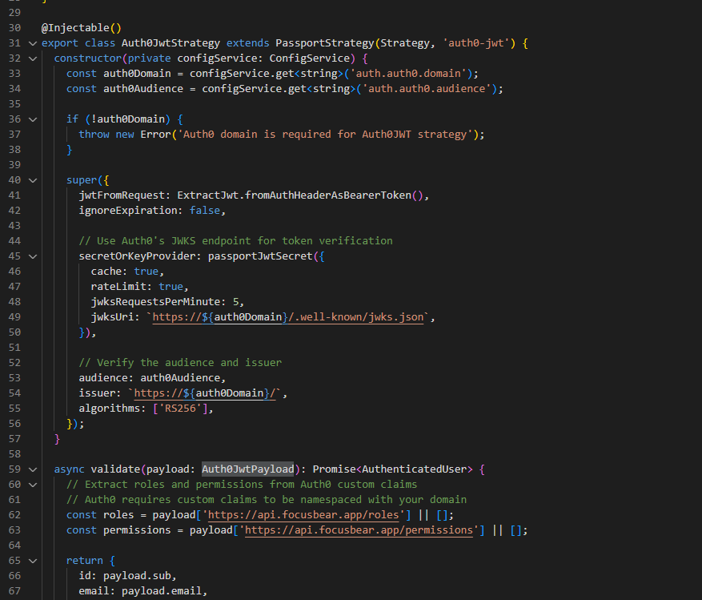
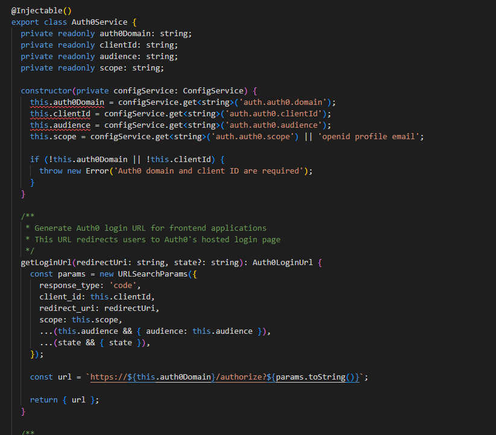
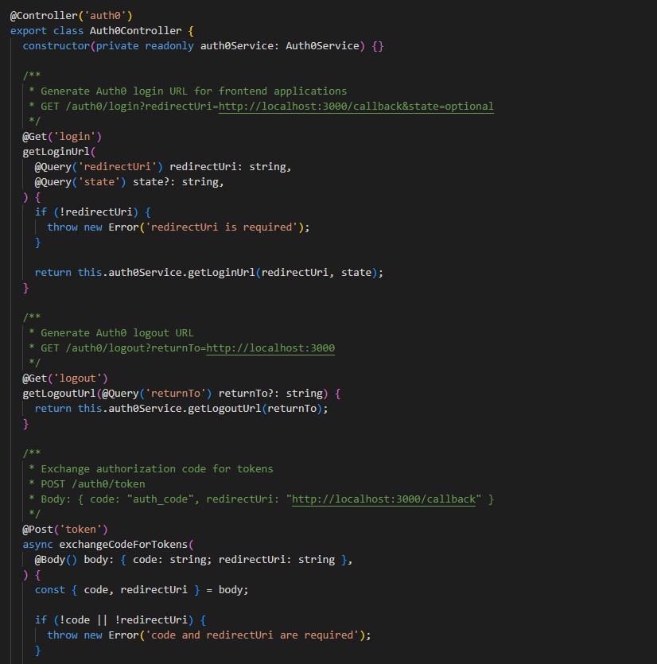
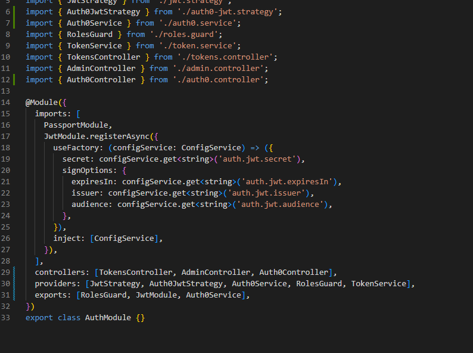
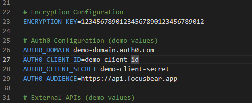

# Authentication in NestJS with Auth0 & JWT

## How does Auth0 handle authentication compared to traditional username/password auth?

Auth0 is like having a professional security company handle your building's security instead of you doing it yourself. Traditional authentication means you store usernames and passwords in your own database, handle password hashing and validation yourself, and build all the login forms and password reset flows. You're responsible for security vulnerabilities and updates, and users have to create accounts for every application.

Auth0 authentication is different because Auth0 stores and manages user credentials securely, provides a hosted login page with professional security, and lets users log in with social accounts like Google or Facebook. Auth0 handles password resets, email verification, and security updates automatically. It also provides Single Sign-On so users can access multiple apps with one login, plus multi-factor authentication and advanced security features are built-in.

Here is my Auth0 JWT strategy showing JWKS integration and proper token verification:

Here is my Auth0 service with login/logout methods and token exchange functionality:

## What is the role of JWT in API authentication?

JWT acts like a digital ID card for your API. Once a user logs in through Auth0, they receive a JWT token that contains user information like ID, email, and roles without needing to check the database every time. Users send this token with each API request to prove who they are, and tokens automatically expire for security.

The JWT structure is header.payload.signature, where the payload contains user information. Think of JWT like a concert wristband - once you get it at the entrance during login, you can access different areas or API endpoints without having to show your ID again. The wristband has information about what you're allowed to access.

Here is my Auth0 controller showing protected routes that require JWT tokens:

## How do jwks-rsa and public/private key verification work in Auth0?

This is like having a secure way to verify that an ID card is real and not fake. Auth0 has a private key that they keep secret to sign JWT tokens, and they share a public key that can verify if tokens are real. Only Auth0 can create tokens with their private key, but anyone can verify them with the public key.

JWKS is a list of public keys that Auth0 provides at their well-known endpoint. The jwks-rsa library automatically downloads these public keys from Auth0's JWKS endpoint, caches them for better performance, verifies incoming JWT tokens using the correct public key, and handles key rotation when Auth0 updates their keys.

Here is my Auth module showing how Auth0 components are integrated:

## How would you protect an API route so that only authenticated users can access it?

In NestJS with Auth0, you protect routes using Guards, which are like bouncers at a club who check IDs before letting people in. You can use the Auth0 JWT guard on specific routes, set up global protection for all routes, or add role-based protection for admin-only areas.

When a user accesses a protected route, they send an API request with a JWT token in the Authorization header. The Auth0JwtStrategy extracts the token, downloads Auth0's public key using jwks-rsa, verifies the token signature and expiration, and extracts user information from the token payload. If the token is valid, user info gets added to the request object and the route handler runs. If invalid, a 401 Unauthorized error is returned.

Here is my environment configuration showing Auth0 settings:

