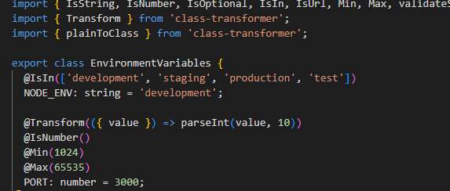

# Handling Environment Variables & Configuration in NestJS

## How does @nestjs/config help manage environment variables?
The @nestjs/config package makes it super easy to organize and access all your environment variables in one place. Instead of using `process.env.SOMETHING` scattered throughout your code, you inject the ConfigService and get type-safe access to configuration values.

It loads .env files automatically, validates your environment variables to make sure nothing important is missing, and lets you organize configuration into logical groups like database settings, API keys, and authentication config. The validation happens when the app starts, so you catch missing variables before they cause problems.

Here is my ConfigModule setup with validation and configuration files:

Here is my validation schema using Joi:

## Why should secrets (e.g., API keys, database passwords) never be stored in source code?
Secrets in source code are like leaving your house key under the welcome mat - anyone who finds your code can see everything. When you commit secrets to Git, they stay in the history forever, even if you delete them later. Other developers, contractors, or anyone with repository access can see all your sensitive information.

If someone gets your API keys, they could run up huge bills on your accounts, access private user data, or completely take over your external services. Database passwords in code mean anyone who sees the repository can access your entire database.

Here is my .env.example file showing safe template values:

Here is my .gitignore file protecting sensitive environment files:

## How can you validate environment variables before the app starts?
NestJS lets you validate environment variables using either Joi schemas or class-validator decorators. The validation runs during application bootstrap, so if anything is missing or invalid, the app won't start and you get clear error messages about what's wrong.

With Joi, you define a schema that specifies which variables are required, what types they should be, and what values are acceptable. Class-validator uses decorators to validate individual properties and can transform values to the right types automatically.

Here is my Joi validation schema with different validation rules:

Here is my class-validator approach for environment variable validation:

## How can you separate configuration for different environments (e.g., local vs. production)?
You create different .env files for each environment and load the right one based on NODE_ENV. The ConfigModule can load multiple files in priority order, so you can have .env.local override .env.development which overrides .env.

You can also use environment-aware configuration where different values get loaded based on the current environment. For example, development might use synchronize: true for the database while production uses synchronize: false and requires SSL connections.

Here is my configuration showing environment-specific database settings:

Here is my configuration controller demonstrating safe vs unsafe values to expose:

