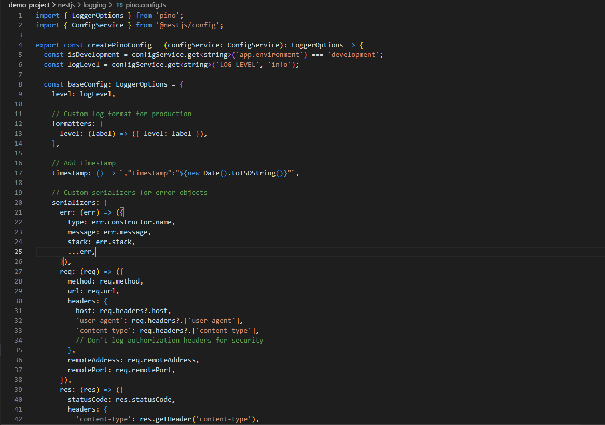
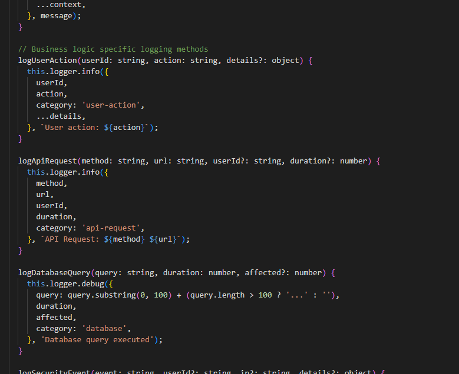
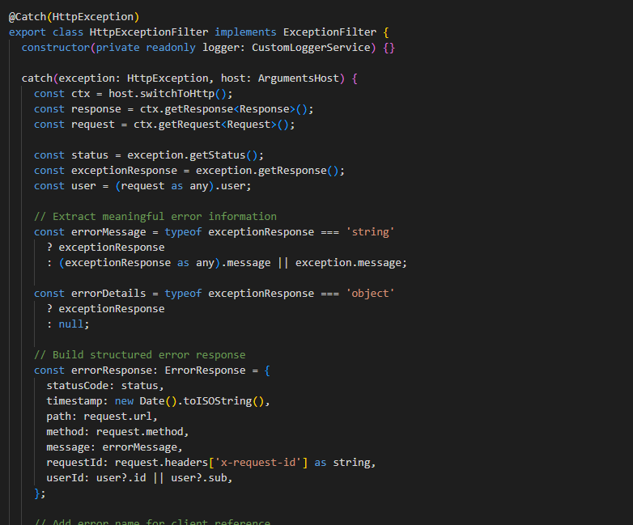
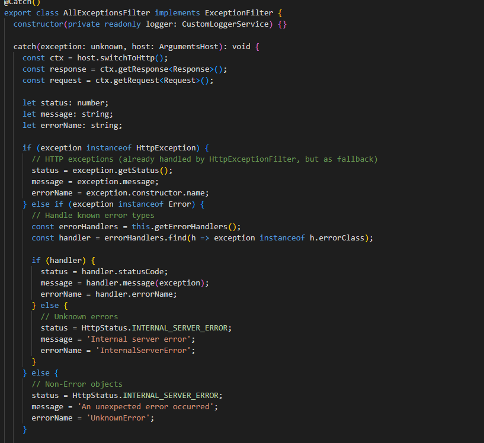
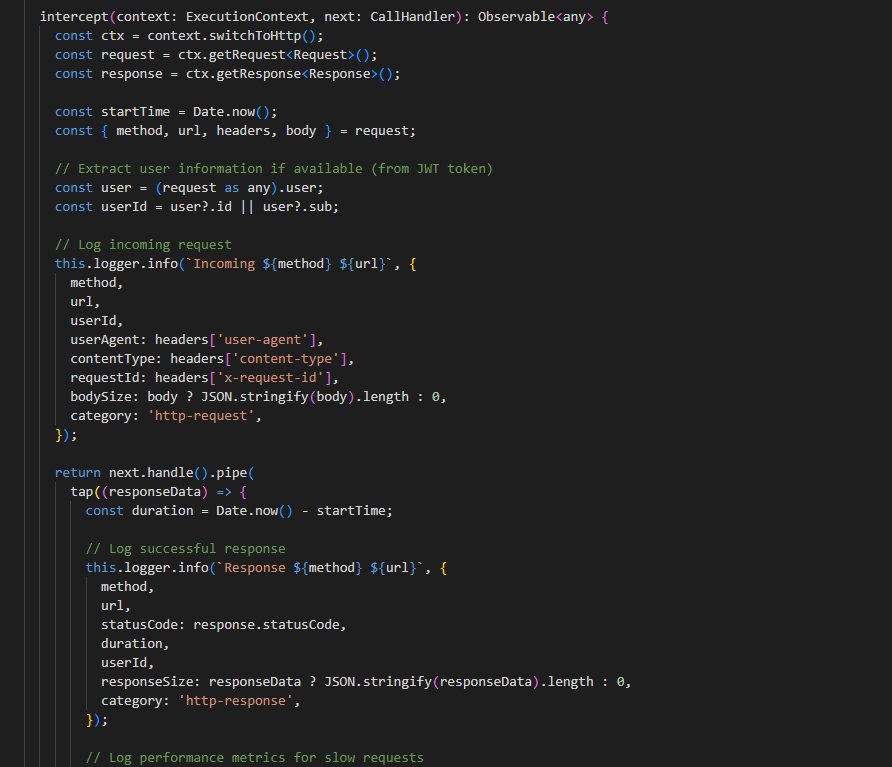
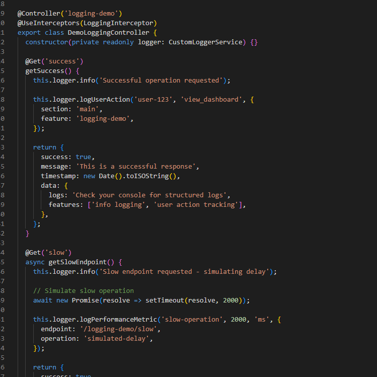
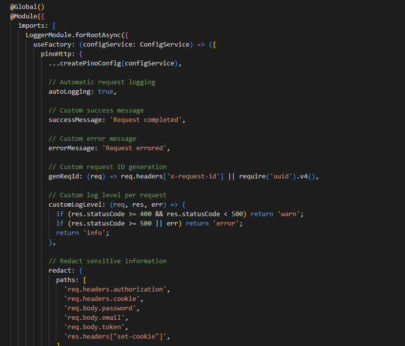
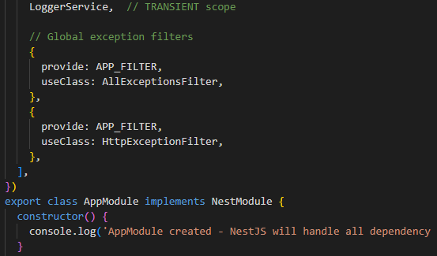
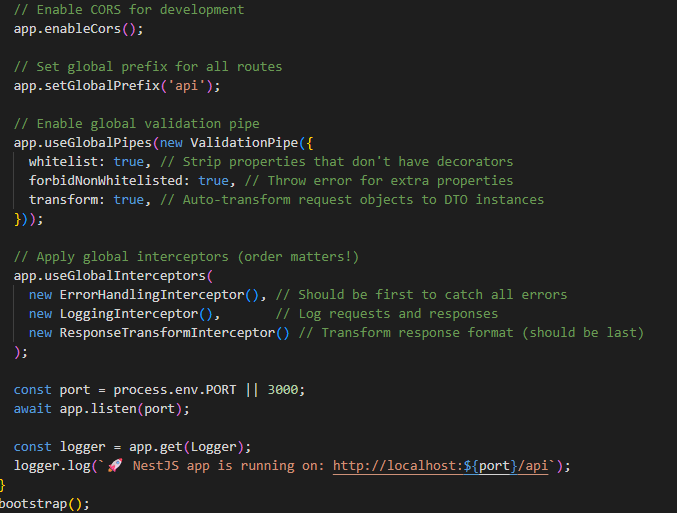

# Logging & Error Handling in NestJS

## What are the benefits of using nestjs-pino for logging?
Nestjs-pino gives you structured JSON logging that's perfect for production environments. Instead of messy console logs, you get organized data that logging systems can easily search and analyze. It's super fast because Pino is designed for performance, and it automatically includes request context in every log without you having to pass it around manually.

The package also handles request IDs, redacts sensitive data like passwords automatically, and formats everything consistently. In development, it can pretty-print logs with colors, but in production, it outputs clean JSON that works great with log aggregation tools.

Here is my Pino configuration showing development vs production settings:

Here is my custom logger service with business-specific logging methods:

## How does global exception handling improve API consistency?
Global exception handling makes sure every error in your API gets formatted the same way, no matter where it happens. Without it, different controllers might return different error formats, which confuses frontend developers and makes debugging harder.

With global filters, all errors get the same structure - status code, timestamp, error message, and request details. This means clients always know what to expect when something goes wrong, and you can log all errors in one place with consistent information.

Here is my HTTP exception filter that standardizes error responses:

Here is my all-exceptions filter that catches uncaught errors:

## What is the difference between a logging interceptor and an exception filter?
A logging interceptor runs before and after successful requests to track normal operations like API calls and performance metrics. An exception filter only runs when something goes wrong to handle errors and log failures.

The interceptor sees every request and can measure things like response time and request size. The exception filter only sees requests that throw errors and focuses on formatting error responses and logging the problems. They work together - interceptors handle the happy path logging, while filters handle the error path.

Here is my logging interceptor that tracks all HTTP requests and responses:

Here is my demo controller showing different types of errors being handled:

## How can logs be structured to provide useful debugging information?
Structured logs use consistent fields that make searching and filtering easy. I include context like user ID, request ID, method, URL, and timing information in every log entry. For errors, I add stack traces and error types. For business events, I include relevant data like which user did what action.

The key is using the same field names everywhere - always "userId" not sometimes "user_id" or "userID". I also categorize logs with tags like "http-request", "database", "security" so you can filter by type when debugging. Request IDs let you trace a single user's journey through multiple services.

Here is my logging module configuration with structured formatting:

Here is my application module setup with global exception filters:

Here is my main.ts file showing Pino logger integration:
