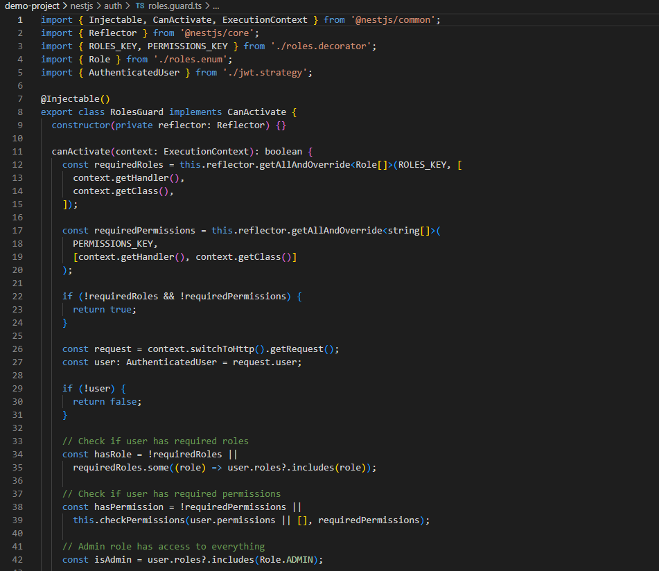

# Role-Based Authorization (RBAC) in NestJS

## How does Auth0 store and manage user roles?
Auth0 stores user roles and permissions in a structured way that makes them easy to manage and secure. When you set up RBAC in Auth0, you create roles like "admin" or "user" and assign specific permissions to each role.

Auth0 adds roles and permissions to JWT tokens as custom claims using your domain namespace. So instead of just having basic user info, the token includes something like `"https://api.focusbear.app/roles": ["admin"]` and `"https://api.focusbear.app/permissions": ["users:read", "system:write"]`.

Here is my JWT strategy showing how roles are extracted from Auth0 tokens:

Here is my role enum and permission interface definitions:

## What is the purpose of a guard in NestJS?
Guards in NestJS are like security checkpoints that decide whether a request should be allowed to continue to the route handler. They run after middleware but before interceptors and pipes.

Guards implement the `CanActivate` interface and return true (allow access) or false (deny access). They're perfect for authentication and authorization because they can check if a user is logged in and has the right permissions before the actual route logic runs.

Here is my RBAC guard implementation:

Here is my JWT auth guard for authentication:

## How would you restrict access to an API endpoint based on user roles?
You restrict access by combining decorators and guards. First, you add the `@Roles()` or `@Permissions()` decorator to specify what's required. Then you apply the `@UseGuards()` decorator to activate the security checks.

The guard reads the metadata from the decorators, checks the user's token for matching roles or permissions, and either allows or blocks the request. Admin users get special treatment and can access everything.

Here is my admin controller with role-based endpoint protection:

Here is my roles decorator implementation:

## What are the security risks of improper authorization, and how can they be mitigated?
Improper authorization can lead to serious security problems. Users might access data they shouldn't see, modify things they can't change, or perform admin actions without permission. This could expose sensitive information or let attackers take control of the system.

To prevent these issues, you should validate permissions at multiple levels, use least-privilege principles (give users only what they need), implement proper error handling that doesn't leak information, and regularly audit user permissions to make sure they're still appropriate.

Here is my token service showing different permission levels:

Here is my demo tokens endpoint for testing authorization:

Here is a demonstration of the RBAC system protecting different endpoints:
