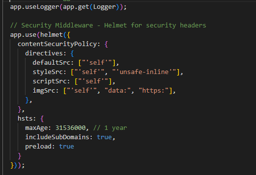
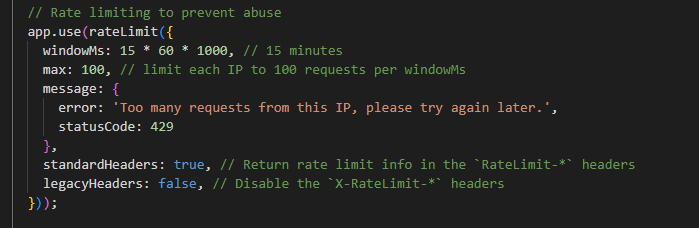

# Security Best Practices in NestJS

## What are the most common security vulnerabilities in a NestJS backend?

After working with the demo project, I found these main security risks that can hurt a NestJS app:

**Injection attacks** are really dangerous - when someone puts malicious code into my database queries or commands. SQL injection is the most common one where hackers can steal or delete data.

**Cross-site scripting (XSS)** happens when bad scripts get injected into web pages. Users might get their cookies or passwords stolen without knowing it.

**Missing access controls** means users can access stuff they shouldn't. Like regular users getting into admin areas or seeing other people's data.

**Exposed secrets** is when I accidentally put passwords or API keys in my code where everyone can see them. This is super bad for production apps.

## How does `helmet` improve application security?

Helmet makes my app way more secure by adding special headers to every response. It's like putting a protective shield around my application.

When I added helmet to the demo project, it automatically started setting headers that prevent common attacks. The coolest part is **Content Security Policy** - it tells the browser what scripts and styles are allowed to run. This stops XSS attacks from working.

**HSTS** forces browsers to always use HTTPS, so no one can intercept my users' data. I set it for a whole year so users stay protected.

All I had to do was add this to main.ts:


Now every response gets these protective headers automatically. It's like having a security guard that never sleeps.

## Why is rate limiting important for preventing abuse?

Rate limiting saves my app from getting hammered by too many requests. It's like having a bouncer at a club who only lets in so many people at a time.

Without rate limiting, someone could spam my API with thousands of requests and crash my server. Or hackers could try to guess passwords by making tons of login attempts really fast.

I set up rate limiting in the demo project to allow 100 requests per 15 minutes per IP address. If someone goes over that limit, they get a "Too many requests" error and have to wait.



This keeps my server running smooth and stops bad actors from causing trouble. Normal users never hit this limit, but attackers get blocked.

## How can sensitive configuration values be protected in a production environment?

The biggest rule I learned is **never put secrets in your code**! I always use environment variables for things like database passwords and API keys.

For the demo project, I created a SECURITY.md file and mentioned the right way to handle secrets. The main things I need to remember:

**Keep secrets out of git** - My `.env` file should never be committed. Only `.env.example` with fake values goes in git.

**Use cloud secret managers** in production like AWS Secrets Manager. These are way more secure than just environment variables on the server.

**Validate secrets at startup** - If my app needs a JWT secret in production, it should crash if it's missing:
```typescript
if (process.env.NODE_ENV === 'production' && !process.env.JWT_SECRET) {
  throw new Error('JWT_SECRET is required in production');
}
```

**Never log secrets** - I should never do `console.log('API key:', apiKey)`. That's how secrets end up in log files where they shouldn't be.

The demo project already has good validation using Joi schemas that check for required environment variables. This means the app won't start if something important is missing, which is much better than crashing later.