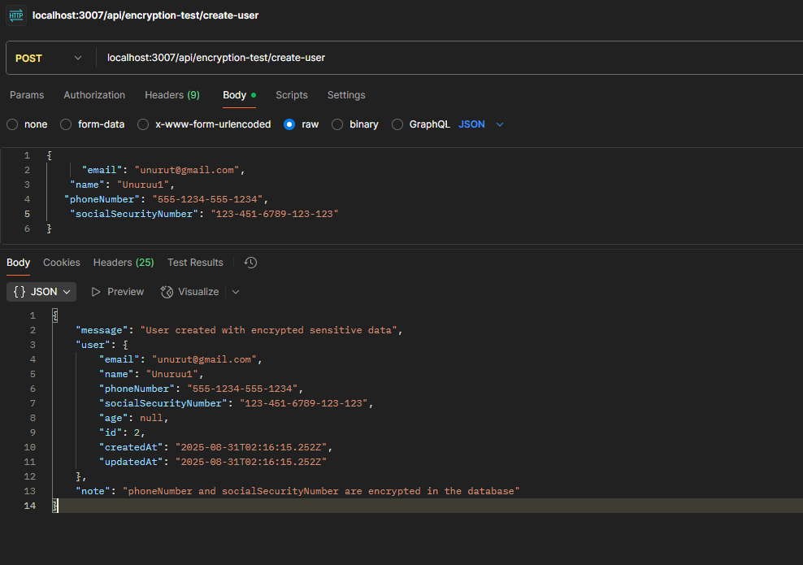
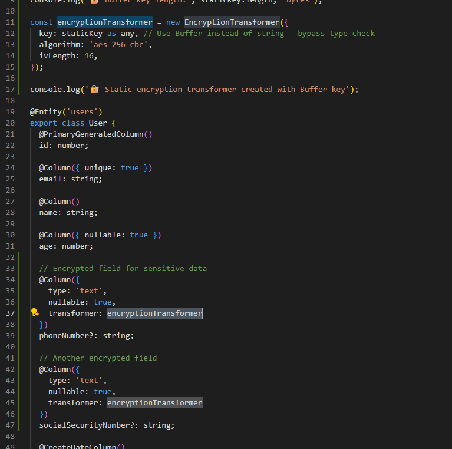
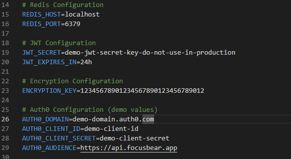
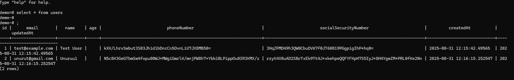

# Using `typeorm-encrypted` for Data Encryption

## Why does Focus Bear double encrypt sensitive data instead of relying on database encryption alone?

Database encryption protects files, but what if someone gets direct database access? That's why Focus Bear adds a second layer - application-level encryption with `typeorm-encrypted`. Even if hackers break into the database, they can't read sensitive fields like phone numbers because they're encrypted again at the code level. It's like having two locked doors instead of one.
Here is my demo app Postman showing POST request creating user with sensitive data

## How does `typeorm-encrypted` integrate with TypeORM entities?

I add a special `transformer` to columns that need encryption. In my User entity, I encrypted `phoneNumber` and `socialSecurityNumber` fields by adding `EncryptionTransformer` to the column decorator. TypeORM automatically encrypts data when saving and decrypts when reading - I don't have to do anything extra in my code.

## What are the best practices for securely managing encryption keys?

The encryption key is stored in environment variables, never hardcoded in files. I added `ENCRYPTION_KEY` to both `.env` and `.env.example` files. The key must be kept secret and different keys should be used for development and production. I also added validation so the app won't start if the encryption key is missing.

## What are the trade-offs between encrypting at the database level vs. the application level?

Database encryption protects against file theft but not database access. Application encryption protects even if someone gets into the database, but you can't search encrypted fields easily. Focus Bear uses both because they protect against different threats - database encryption for files and backups, application encryption for direct database attacks.

