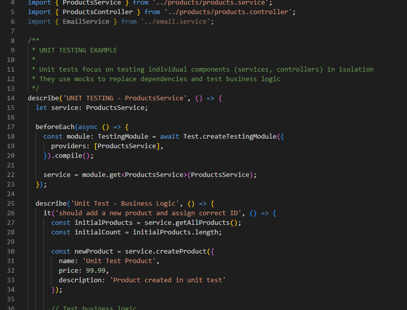
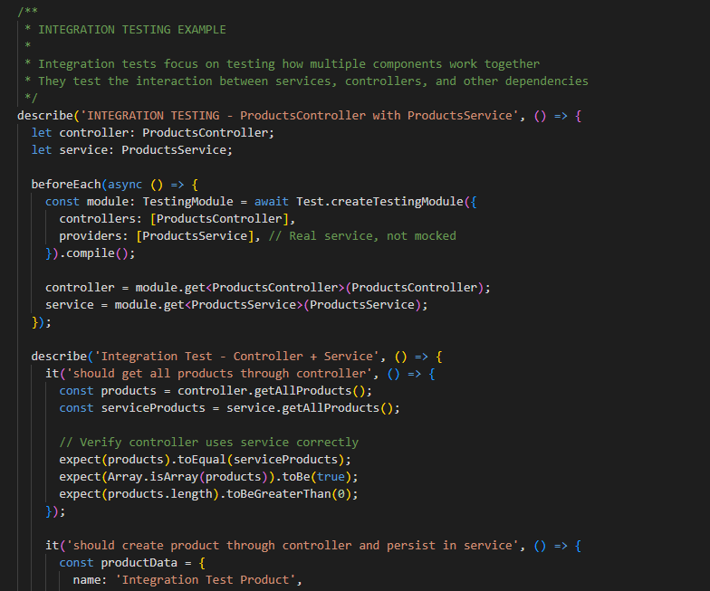
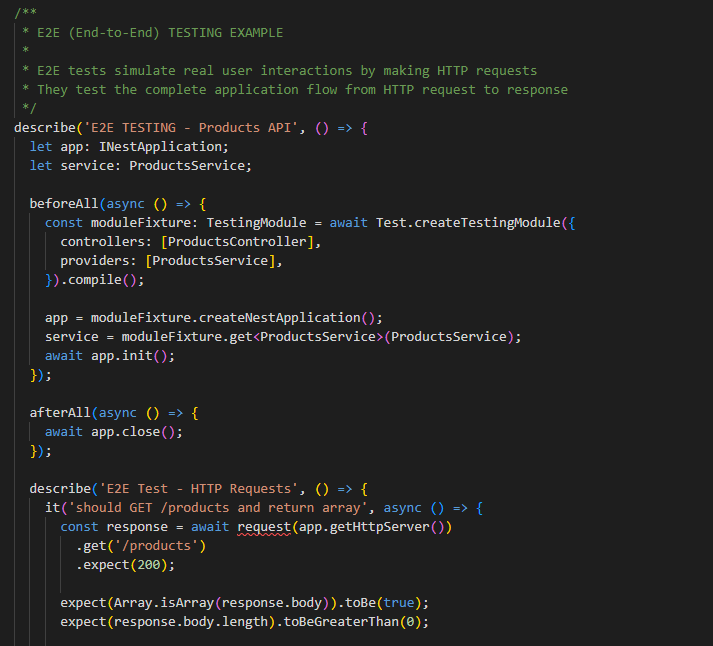
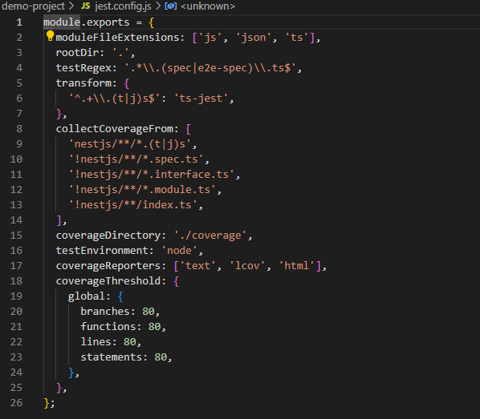
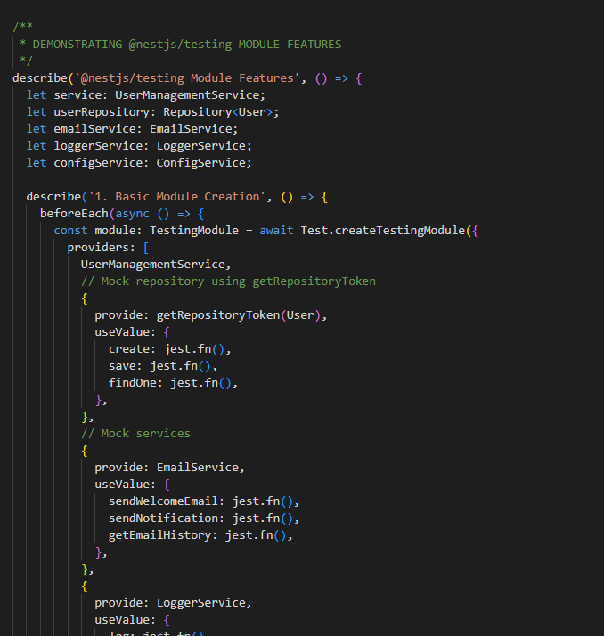
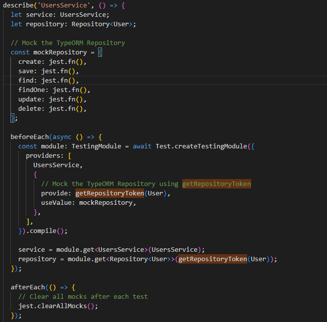

# Introduction to Testing in NestJS

## What are the key differences between unit, integration, and E2E tests?

Unit tests are like checking each ingredient separately before cooking - they test one piece of code by itself using fake versions of everything else it needs. In my demo project, I tested ProductsService alone to make sure it can create, update, and delete products without involving controllers or databases. Integration tests are like testing a whole recipe section - they check how multiple pieces work together. I tested ProductsController with real ProductsService to see if they communicate properly. E2E tests are like serving the full meal to customers - they make real HTTP requests to test the complete user experience from start to finish.
Unit testing:

Integration testing:

E2E testing: 

## Why is testing important for a NestJS backend?

Testing a NestJS backend is like having a safety net for a tightrope walker - it catches problems before they hurt users. In my demo project, when I changed how products are created, my tests immediately told me if I broke anything. Without tests, I might accidentally break the login system while adding a new feature, and users would get locked out. Tests also help me understand how my code should work by showing examples of how to use each function. When other developers join the project, they can read the tests to quickly learn what each part does.

## How does NestJS use @nestjs/testing to simplify testing?

The @nestjs/testing package is like having a special toolkit that makes testing NestJS apps much easier. It provides Test.createTestingModule() which lets me create a fake version of my app with mock services for testing. In my nestjs-testing-module.spec.ts file, I showed how to replace real services with fake ones, override specific providers, and test how different parts interact. This package handles all the complex dependency injection stuff automatically, so I don't have to manually wire up all the connections between services and controllers.

## What are the challenges of writing tests for a NestJS application?

The biggest challenge I faced was dealing with scoped services (REQUEST and TRANSIENT scope) which require using `resolve()` instead of `get()` method. In my EmailService tests, I had to learn this the hard way when tests failed with confusing error messages. Another challenge is mocking complex dependencies like TypeORM repositories - I had to use `getRepositoryToken()` to properly inject fake database connections. Also, testing async operations and making sure mocks are cleaned up between tests can be tricky. The hardest part is knowing what to mock versus what to test with real implementations.

