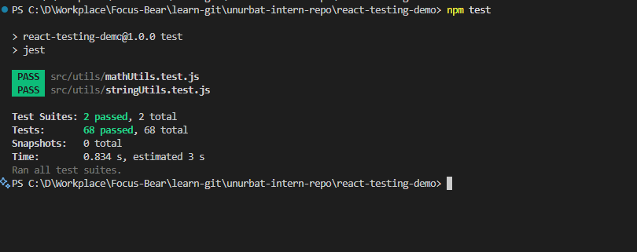
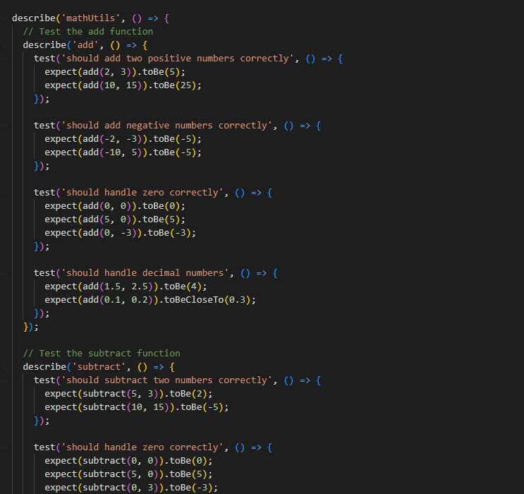
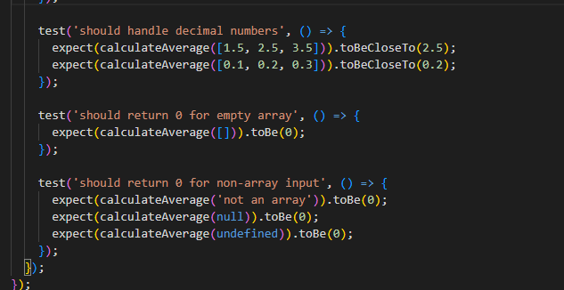

# Introduction to Unit Testing with Jest

## Why is automated testing important in software development?

Automated testing is like having a safety net that catches you when you make mistakes while coding. In my React demo project, I wrote 68 tests that check if my math and string utility functions work correctly. Every time I change the code, I can run `npm test` and immediately know if I broke something. Without tests, I would have to manually check every function by hand, which takes forever and I might miss bugs. Automated tests also help other developers understand what my code is supposed to do by showing examples of how each function should behave.

## What did you find challenging when writing your first Jest test?

The most challenging part was setting up the project configuration correctly. I initially tried to use ES6 modules and Babel, but ran into dependency issues where Jest couldn't find the required packages. I learned that Jest works better with CommonJS syntax (require/module.exports) for simple projects. Another challenge was understanding Jest's assertion methods - I had to learn the difference between `toBe()`, `toEqual()`, `toBeCloseTo()`, and when to use each one. For example, when testing division with floating point numbers, I needed `toBeCloseTo()` instead of `toBe()` because of JavaScript's precision issues.

