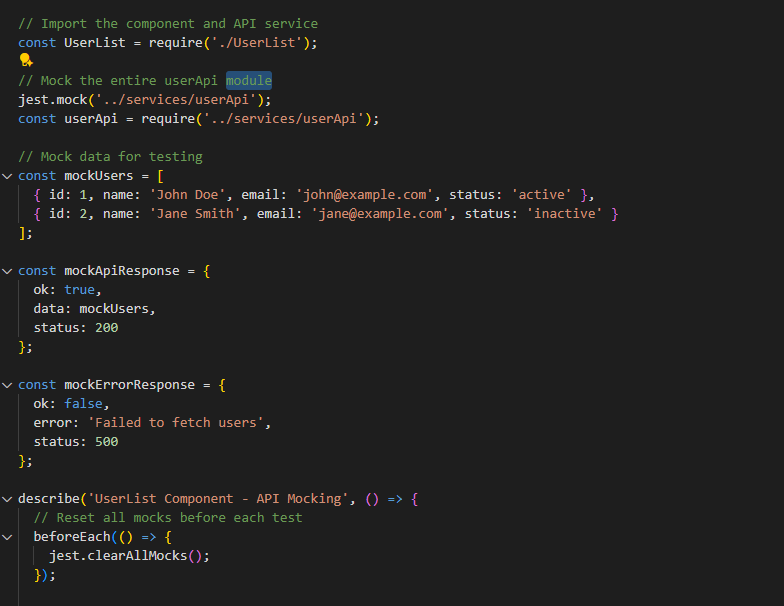
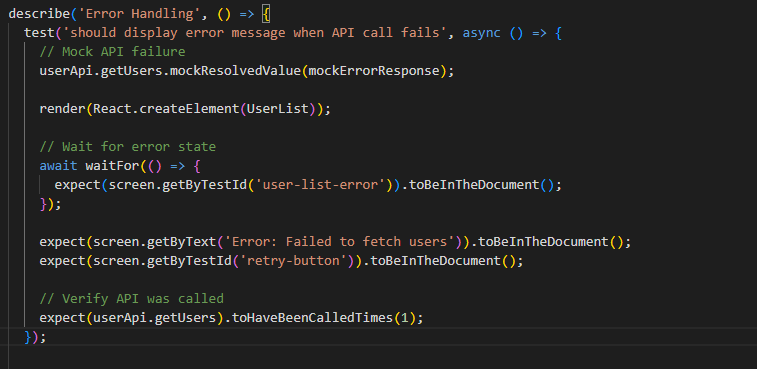
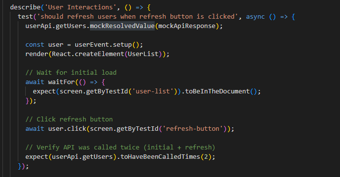

# Mocking API Calls in Jest

## Why is it important to mock API calls in tests?

Mocking API calls is like practicing a play with stand-in actors instead of waiting for the real stars to show up - you can control exactly what happens and when. In my UserList component tests, I used jest.mock() to replace the real userApi with fake functions that return exactly what I want to test. This means my tests run instantly without waiting for network requests, they never fail because the server is down, and I can test error scenarios like network failures without actually breaking anything. Real API calls would make tests slow, unreliable, and dependent on external services that I don't control.

## What are some common pitfalls when testing asynchronous code?

The biggest pitfall is forgetting that async code takes time to finish, like trying to check if cookies are done before putting them in the oven. In my tests, I had to use waitFor() to wait for the loading state to disappear and users to appear in the DOM. Without this, my tests would check for elements before React had time to update them after the API call finished.

Another common mistake is not properly mocking async functions - I learned to use mockResolvedValue() for successful API calls and mockRejectedValue() for errors. Also, React shows warnings about act() when state updates happen outside of user actions, which taught me about the importance of wrapping state changes properly in tests.

