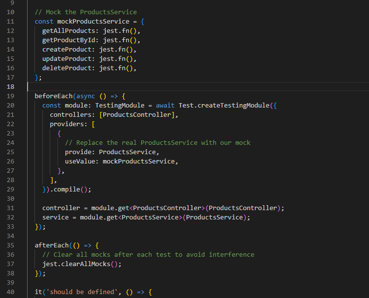
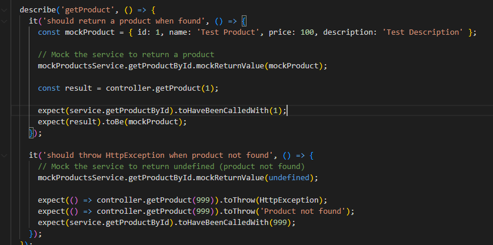
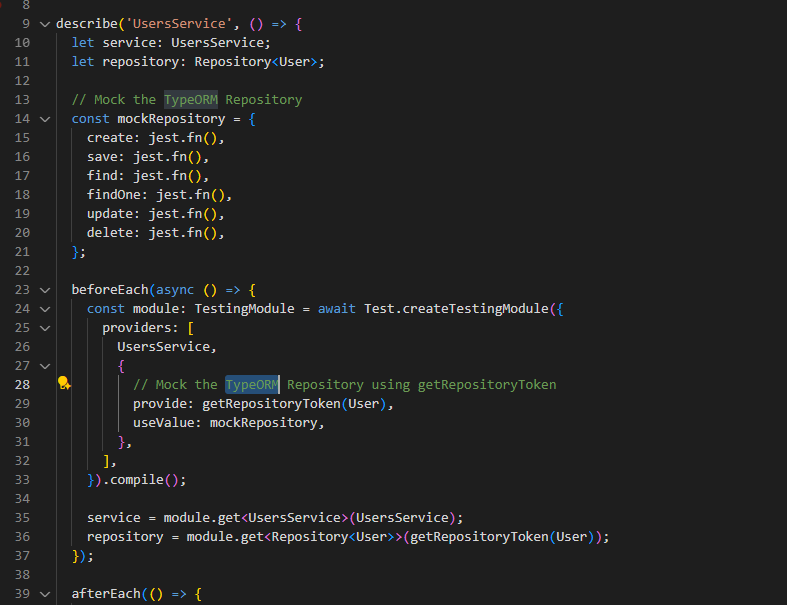
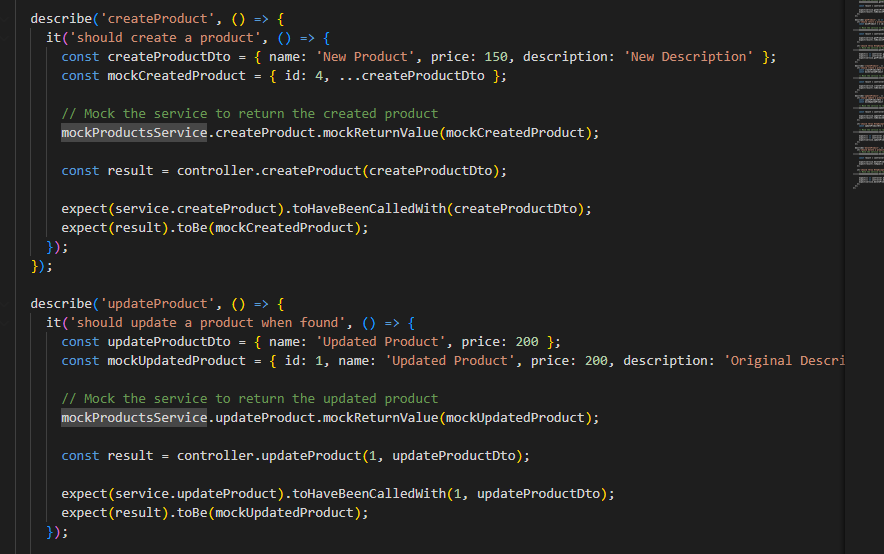

# Mocking Dependencies & Database Interactions in NestJS

## Why is mocking important in unit tests?

Mocking is like using fake ingredients when testing a recipe - you want to test your cooking skills, not whether the store-bought ingredients are good. In my demo project, I used mocks to test if my ProductsController correctly handles different responses from ProductsService without actually running the service logic. This makes tests run faster and lets me control exactly what responses I want to test, like simulating when a product doesn't exist or when the database is unavailable.

## How do you mock a NestJS provider (e.g., a service in a controller test)?

I create a fake version of the service with all the same method names, but instead of real logic, I use jest.fn() to make fake functions. In my ProductsController test, I replaced the real ProductsService with a mock object that has getAllProducts, createProduct, and other methods as mock functions. Then I tell these fake methods what to return using mockReturnValue, so I can test how my controller handles different scenarios like successful operations or errors.

## What are the benefits of mocking the database instead of using a real one?

Using a mock database is like practicing driving in a simulator instead of on real roads - it's safer, faster, and you can control every situation. In my UsersService test, I mocked the TypeORM Repository so tests don't need to connect to a real database, create tables, or clean up data afterward. Mock databases run instantly, never fail due to connection issues, and let me test edge cases like database errors without actually breaking anything. Tests stay isolated and don't interfere with each other.

## How do you decide what to mock vs. what to test directly?

I mock external things I don't control and test my own code directly. In my tests, I mocked the database repository because that's TypeORM's code, not mine. I also mocked services when testing controllers because I want to focus on testing the controller logic, not the service logic. But I tested my actual business logic methods directly, like checking if my ProductsService correctly adds new products to its array. If I wrote the code and it's the main thing I want to test, I test it directly. If it's someone else's code or an external dependency, I mock it.

