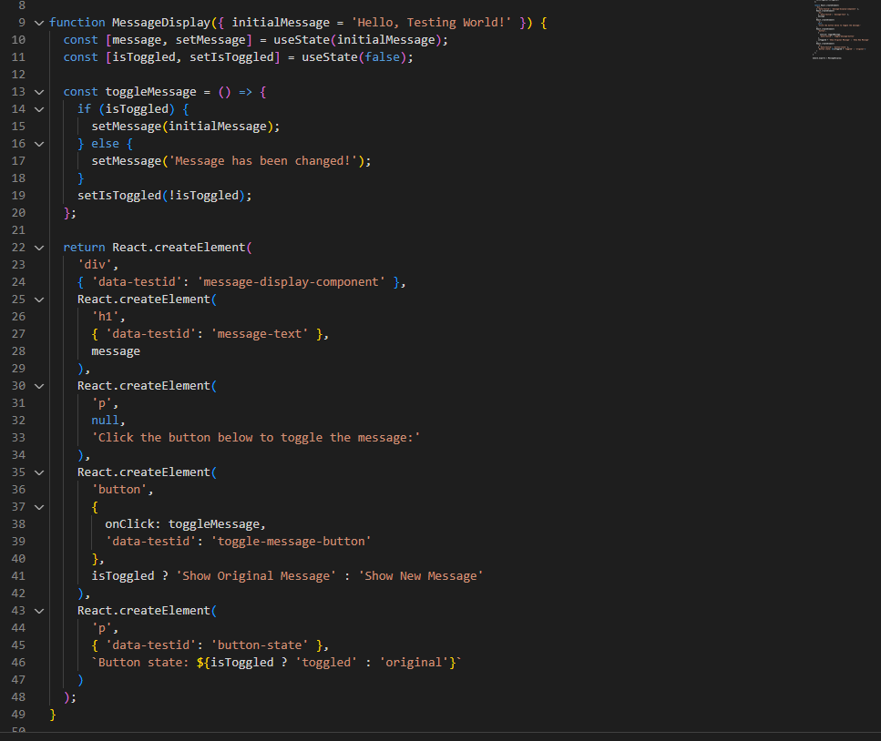
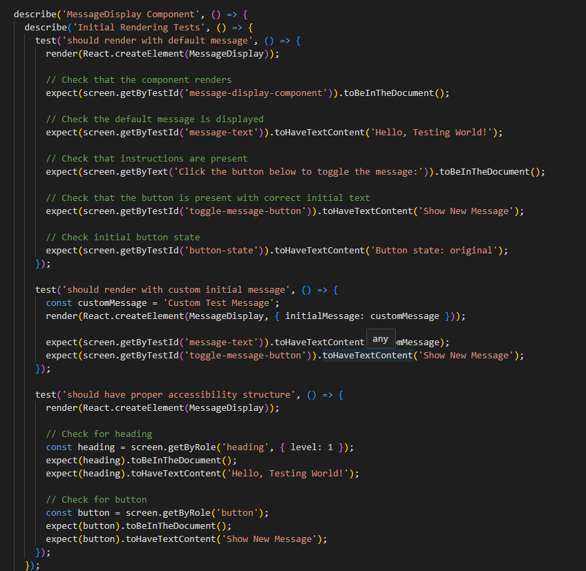
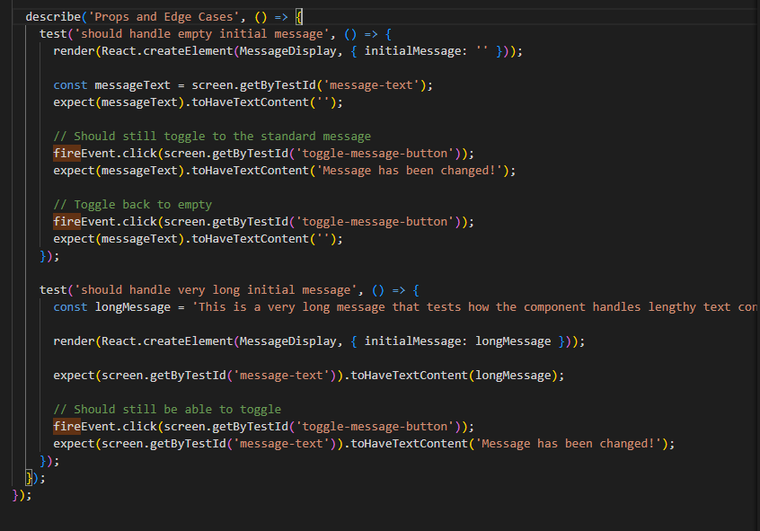

# Testing React Components with Jest & React Testing Library

## What are the benefits of using React Testing Library instead of testing implementation details?

React Testing Library is like testing a car by driving it instead of checking the engine parts - you test what users actually see and do. In my MessageDisplay component, instead of testing if the `isToggled` state is true or false, I test if users can see "Show Original Message" text on the button. This approach makes tests more reliable because when I change how the component works internally but keep the same user experience, my tests still pass. React Testing Library forces me to write tests that check accessibility features like headings and button roles, which makes my components better for everyone.

## What challenges did you encounter when simulating user interaction?

The biggest challenge was learning the difference between fireEvent and userEvent - it's like the difference between manually clicking a mouse versus letting someone naturally click it. With userEvent.click(), I had to use async/await because it simulates real user behavior which takes time, while fireEvent.click() happens instantly. I also got React warnings about act() which confused me at first, but I learned these warnings help ensure my tests match real user interactions. Another challenge was choosing the right way to find elements - getByTestId() for specific components, getByRole() for accessibility testing, and getByText() for content checking.

